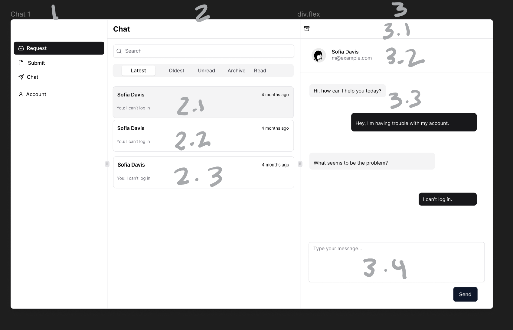

# Chat Design Doc

Please refer to the image for numbers:
Changes to RDS:

- Remove connection ids in the `rooms` table
- New `connections` table

```SQL
room id: references rooms table
participant email: reference rooms table
connection id
PK: room id, participant email
```

- Why?
  - Because one merely needs to update one table
- Assumptions:
  - Participant 1's and participant 2's email will not equal each other
  - For each room, there will already exist two rows in `connections`. That is, when I implement create request, I will make it so that I add a row to `rooms` and two rows to `connections`. However for test data, you must manually add rows to `connections` for each room in `rooms`.
- How to get query and use data for a specific user?
  - For `rooms`, just do a select all where email equals participant 1 or participant 2 email
  - For `connections`, just do a select all where email equals participant email
  - To get a connection id for a particular room, iterate over the data from `connections` until one finds the connection id for the room id
- When does one establish a connection to a WebSocket?
- When one clicks on a room in 2. So, when one clicks on 2.1, a connection will be established to 2.1
- When one clicks a room in 2.
  - There are three cases:
    - (1) a stale connection
      - If a stale connection, then get a new connection id, and update the `connections` table, and update the data structure
    - (2) a live connection
      - If a live connection, then one can merely use said connection
    - (3) no connection id (NULL)
      - If no connection id, then get a new connection id, and update the connection table, and update the data structure
- What data structure to use? I would use map since it is iterable and the order is based on insertions. Last insertion, last element. I would not use Objects.

```
“room_id”: {
			room, // the row in the rooms table
	        messages: {
		        "message_id": first message
		        "message_id": second message
		        }
	        // in other words messages stores the messages for the                room.
	        Important: messages is also a map
		   }
```

- Why?
  - We get O(1) for searches and deletes iirc
  - And, it now makes insertions easier since it is order on insertion, newest messages are last.
- Sending a message:
  - If other participant is not online, then merely insert into the database and insert into the data structure
    - Why into the data structure?
      - Because it does not require doing a whole new query for each message. If the lambda function returns success, then one knows that said message was inserted, if lambda function returns failure, then one knows that message was not inserted
  - If other participant is online, then send the message the other participant and insert the message into the database and insert into the data structure
    - Why into the data structure?
      - See above
- Regarding previews, that is dynamically changing 2.1, 2.2, ...
  - So when a state changes a re-render happens for the component. However, since React uses a virtual DOM, React only re-renders the virtual DOM. Then, React goes to the real DOM, and see if there is any differences, if so, it renders that part of the real DOM, if no difference, then it does not change that part of the real DOM
- A few things to note:
- Since one is going to database to check for changes for 2.1, 2.2..., but going to the websocket for 3, there might be sync issues. For example, I send a message in room 2.1, but the preview changes 5 seconds later. A solution, add a function to the send message button that will trigger a database call for the preview.
  
