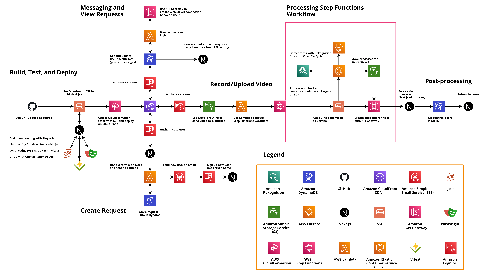
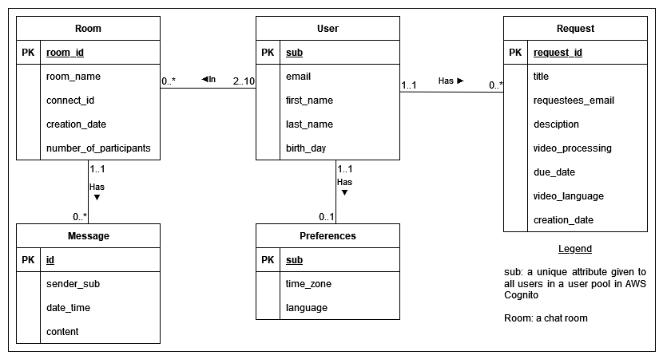
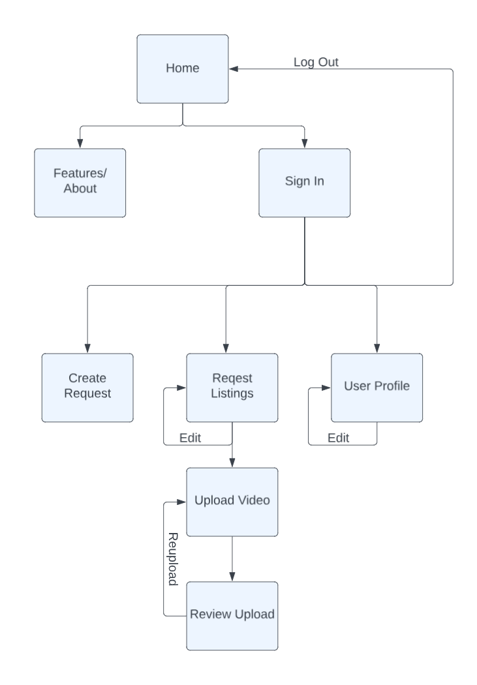
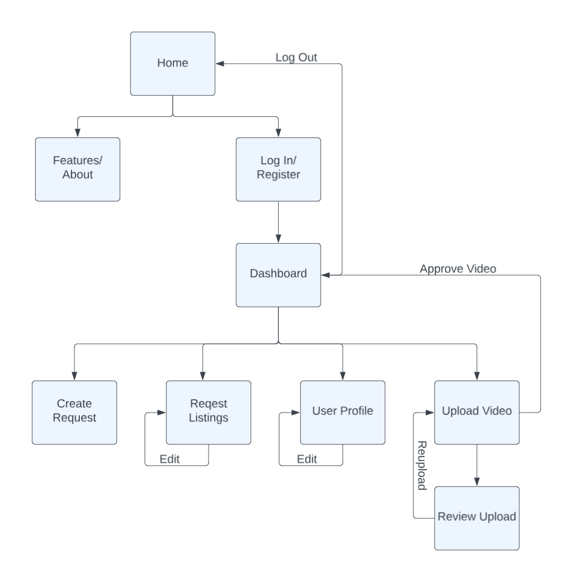

# COSC499 Team 9 Design Document

## Table of Contents

1. [Overview](#introduction)
    - Recap of Prototype
2. [System Architecture](#system-architecture)
    - System Architecture Diagram
    - System Architecture Description  
        - Why you chose this architecture and
        - Why the components are where you put them.
3. [Database Design](#database)
    - ER Diagram
    - Database Description
        - Changes
        - Amazon DynamoDB
4. [User Interface Design](#ui-design)
    - Navigation Diagram
    - Diagram of forgone alternative
    - Explanation of why you chose this design over the alternative
5. [Features](#features):
    - SST - Jan-Yaeger Dhillon
    - Video Submission - Jan-Yaeger Dhillon
    - Authentication - Muhammad Bakar
    - Database Design and Implementation - Muhammad Bakar
    - Request Page - Baz Sivakua
    - Playwright - Baz Sivakua
    - Sign In Page - Soren Stenback
        - For medical reasons, the professor granted Soren Stenback the option not to commit to further work. For these reasons, feature 8 is not present. 
        
6. Other
    - Development Philosophy: Emphasizing agile development for rapid feature rollouts and responsiveness to user feedback.
    - CI/CD Strategy: Implementing a robust CI/CD pipeline using GitHub Actions and Seed for consistent, error-free deployments.
    - Testing Approach: Detailed coverage of testing strategies including Jest for unit tests, Vitest for infrastructure, and Playwright for E2E, ensuring a bug-free user experience.

## Overview

## System Architecture

### System Architecture Diagram

### System Architecture Description

------

#### Serverless Backend
Our backend architecture is serverless, utilizing AWS Lambda for compute operations, which allows for automatic scaling and management of the infrastructure. This aligns with our need for a cost-effective, low-maintenance solution capable of handling variable workloads. The serverless approach also allows us to focus on developing our app, instead of managing infrastructure. Further, we wanted to get experience with the serverless approach, as it is becoming increasingly popular and obviously integrates well with AWS. SST provides the Function construct, which allows us to easily create Lambda functions, but we can also use the AWS CDK if needed.

#### Communication between Users
For real-time user messaging, we plan to implement a WebSocket connection using the SST construct for Amazon API Gateway. This service manages the persistent connections needed for real-time bi-directional communication, which is essential for the chat feature of our app. Further, we can employ Amazon DynamoDB to store user connection information, which is critical for associating messages with specific users. This approach allows us to easily scale our messaging service, and the serverless nature of API Gateway ensures that we only pay for the resources we use. Finally, this makes it easy to integrate into our Next.js app, as we can use Next.js' API routing to make an API call to our API Gateway endpoint and start the WebSocket connection. Finally, Amazon Simple Email Service (SES) will be used for sending emails, which is critical for sending notifications to users about requests and messages.

#### Video Processing
Video processing is managed by AWS Step Functions, orchestrating a workflow to handle the video processing. Step Functions helps manage how the system react to the decisions the user makers, such as choosing to re-record the video. After extracting the uploaded video from S3, we can send it to a containerized service running with Fargate on ECS. The container will have a Python environment and use the Amazon Rekognition API to detect faces in the video, and then use OpenCV to blur the faces. SST provides the Service construct, which allows us to easily deploy our service to ECS with Fargate. This approach allows us to easily scale our video processing workflow, and the serverless nature of Fargate ensures that we only pay for the resources we use. Finally, this makes it easy to integrate into our Next.js app, as we can use Next.js' API routing to make an API call to our API Gateway endpoint and start the video processing workflow.

#### Storage and Database
Amazon S3 is utilized for storing static assets and user-uploaded videos, providing a durable and secure solution. Amazon DynamoDB serves as our database, storing user, messaging, and connection information, which is critical for associating messages and videos with specific users. DynamoDB is a NoSQL database, which is a good fit for our app, as we do not need to store relational data. Further, DynamoDB is a serverless database, which means we do not need to manage the infrastructure, and it is highly scalable, which is important for our app. Finally, it integrates well with other AWS services, like Lambda and API Gateway, which is important for our app. SST provides the Table construct, which allows us to easily create a DynamoDB table, and the Bucket construct, which allows us to easily create an S3 bucket and bind it to our Next.js app.

#### API Routing

We use Next.js' API routing to create API endpoints for our app, which allows us to easily communicate with our backend services. This approach allows us to easily integrate our backend services with our Next.js app. We can also use the Api construct to create endpoints between backend services, which is useful for communication between services, like our messaging service and our video processing service.

#### Authentication and Authorization
We use Amazon Cognito for user authentication and authorization, which provides a secure and scalable solution for user management. This allows us to easily manage user accounts and permissions, and provides a secure way to authenticate users. However, as we are using Cognito, we are limited to using Cognito's hosted UI for authentication, which means we cannot customize the login page. This is a limitation of Cognito, and we intend to use SST's own `Auth construct in the future, which will allow us to customize the login page and easily integrate the login providers we have chosen, being Google, Facebook, and Microsoft.

#### Continuous Integration and Deployment
We adopted GitHub Actions for our CI/CD pipeline, automating our testing and deployment process. Our codebase undergoes automated tests, and upon successful completion, Seed reploys the latest build of our SST app to AWS, ensuring that our production environment is always up to date with the latest changes. We can also use the SST CLI to deploy and test our app locally. We had initially planned to use AWS CodeBuild and CodePipeline for our CI/CD pipeline, but we decided to use GitHub Actions instead, as it is easier to use and provides us with more flexibility.

#### UI/UX

We use React and Tailwind CSS for styling our app, which allows us to easily customize the design and build a responsive app. We also use shadcn's UI library for Tailwind CSS, which provides us with beautiful components that we can use to build our app. See the Frameworks section for more information.

#### Testing

We use Jest for front-end unit testing, Vitest for testing AWS infrastructure, and Playwright for end-to-end testing. Our unit tests are run automatically as part of our CI/CD pipeline, and our end-to-end tests are run manually before each deployment. We also use ESLint to ensure that our code adheres to coding standards.

#### Frontend Hosting and Delivery
Our frontend is built using Next.js and hosted on Amazon CloudFront, which provides a fast content delivery network (CDN) service. This ensures low-latency access to our app globally, improving the user experience by reducing load times. Further, we can use the server-side rendering and static site generation capabilities of Next.js to improve performance and SEO. 

#### Design Choices and Changes

----

##### **Change 1: Switch from Amplify to SST:**

Initially, we used AWS Amplify for backend management, but we faced limitations in backend customization and direct AWS service integration. Shifting to SST significantly enhanced our backend flexibility, allowing direct use of AWS services like Lambda, API Gateway, and Step Functions. This change enabled a more customized, scalable solution, better aligned with our application's specific needs. Further, SST's OpenNext Next.js adapter allowed us to deploy our Next.js app directly to AWS, instead of having to deploy to Vercel, which is the default deployment method for Next.js apps. At the time of planning, Amplify was not yet integrated with Next.js, so we chose to use SST instead. However, Amplify has since gotten a Next.js adapter of there own, so we could have used Amplify instead of SST, but we are still happy with our decision to use SST, as it has allowed us to have more control over our backend and has allowed us to learn more about AWS services. While Amplify also offers higher-level abstractions for things like S3 and Authentication, SST has better support for various AWS services, like Fargate and API Gateway, and we are able to use the AWS CDK if needed.

##### **Change 2: Streamlining Architecture:**
We initially planned to implement technologies like Elasticache and Batch for optimization. However, to focus on our core product, we decided to streamline our architecture, removing these components. This reduction in complexity accelerated development and allowed us to concentrate on delivering essential features, ensuring a solid foundation before considering such optimizations. Further, we have learned it can be best to forgo optimizations until they are needed, as they can be costly to implement and maintain. SST and the CDK enable us to easily add these components in the future if needed or desired. And while the CI/CD of Amplify is nice, we use Seed to deploy our app, which is also very easy to use and allows us to deploy our app from GitHub to AWS.

##### **Change 3: Authentication:**
We originally intended to have a sign-in option through Apple. However, they have stringent requirements regarding their social sign-in program. Satisfying Apple would negatively affect other aspects of the project because it would have taken attention away from said aspects. Also, we planned on having a sign-in option through Amazon, but we eliminated Amazon because we believe that Facebook, Google, and Microsoft social sign-in would capture the vast majority of Amazon users. Thereby eliminating an extra element of worry and management. 

##### **Change 4: Consolidating Tables:**
The original plan was to have five tables in DynamoDB; however, we only have two tables now since AWS recommends having as few tables as possible.

##### **Choice 5: DynamoDB:**
DynamoDB was selected because it natively integrates well with other AWS services.

##### **Choice 6: Social Sign-in:**
We decided to go with only social sign-in because we felt that the vast majority of users prefer social sign-in, and exclusive social sign-in significantly boosts security

#### **Choice 7: Social Sign-in Page:**
We decided to use a pop-up dialogue window as that seemed more user-friendly than redirecting to an entirely new page to log in.

##### **Change 8: Reducing Buttons:**
In response to the change in the social sign-in option, the original design was reduced from five log-in options to only three, representing the three most popular options of Google, Facebook, and Microsoft.

#### **Change 9: Request Listings Page:**
Originally, we decided that the layout of the request listings page would display all requests in the same format as the preview card in the Create Request page. We decided this was too cluttered and decide to streamline it by displaying a smaller card with the title and relavant information and once selected would display the hidden information such as description.

##### **Change 10: Upload Video:**
We changed the access path of the Upload Video page insteaf of being accessed through the navigation bar at the top of the page, would instead be linked through a button on the Request Listings Page, this is a better flow because uploading a video corresponds with a request. 

#### Frameworks

----

The key frameworks we are using for our app are **Next.js** and **Tailwind CSS** for the front-end, and **SST** for the back-end:

##### Next.js

------------------

[Next.js](https://nextjs.org/) is a React framework with server-side functionality. We chose Next.js for the following reasons:
- Next.js is a great framework for building React apps because it allows us to build a React app with server-side functionality and API routing.
- Next.js enables us to hybrid sites, allowing us to have both static and server-side rendered pages.
- Thanks to SST's OpenNext Next.js adatper, we are able to get the full functionality of Next.js while still being able to deploy our app on AWS instead of Vercel.
- The API routing functionality of Next.js allows us to easily create API endpoints for our app and allow our front-end to communicate with our back-end services.

##### TailwindCSS

------------------

[TailwindCSS](https://tailwindcss.com/) is a utility-first CSS framework that allows us to build custom designs without having to write custom CSS. We chose TailwindCSS for the following reasons:
- TailwindCSS allows us to write CSS directly in our React JSX, which is preferable for maintainability and readability.
- Tailwind has many useful utility classes that enable rapid development, with the ability to easily customize the design.
- We used [shadcn's UI library](https://ui.shadcn.com/) for TailwindCSS, granting us access to beautiful components that we can use to build our app.

##### SST

------------------

[SST](https://sst.dev/) is an open-source framework for AWS that allows us to easily integrate our Next.js app with the various AWS services. We chose SST for the following reasons:
- SST is a wrapper for the AWS CDK, which allows us to create AWS infrastructure with code, and it provides various abstractions that make it easier to use than the CDK.
- SST is open-source and has a great community, which means we can easily find help if we run into issues. 
- They place a strong emphasis on developer experience, which means we can easily get started with SST and learn how to use it.
- SST allows us to easily deploy our app to AWS, and provides a local development environment for us to test our Lambda functions locally.
- SST, through OpenNext, allows us to deploy our Next.js app directly to AWS with full functionality, instead of having to deploy to Vercel, which is the default deployment method for Next.js apps.

## Database

### ER Diagram

    
### Database Description
- Quick summary: a user can make many video requests and has preferences. Moreover, the user can be in many chat rooms, each with at least two users and a maximum of 10 users. 
- The center of the ER diagram is the User entity. Placing the user at the center of the ER diagram meant putting them at the center of the user experience and development. That is, placing the user at the center of the ER diagram meant we would develop a web app that places the user at the center. 
    - Of course, another possible way to model the web app is to place the Request entity at the center. Such a diagram would have the consequence that, for example, there would be only one chat room per request. However, the ladder approach would not have worked since we wish to develop a project that could easily be extended beyond the MVP. By having the requests at the center, the user will only be able to interact with other features mediated through request, leading to a one-dimensional web app. Early in the process, around the time of conceptualizing the MVP, there was some thought given to this ladder approach. However, such a model was abandoned for the reason mentioned above. 
- The ER diagram is implemented in Amazon DynamoDB 
- [Amazon DynamoDB](https://aws.amazon.com/dynamodb/) is a NoSQL database that uses key-value to store data.
- One of the great features of DynamoDB is the its ability to scale well, meaning that one only pays for what one uses.
- Additionally, given the heavily reliance of the web on AWS services, a database which works well with AWS is needed. Luckily, DynamoDB has great intergation with AWS.
- Moreover, given that is a NoSQL database, it is resilient to change in data. Given early development phases comes with many unexpected changes, DynamoDB is equipped well to handle unexpected changes. 

## UI Design
Navigaton Diagram: \

Forgone Alternative: \

We chose this design over the forgone alternative because we found it redundant to have a dashboard page. We found that many functions of this dashboard page were better implemented in other areas, such as the navigation bar and request listings page. Additionally, if we implemented a dashboard, once you finished a function on another page, such as creating a request, the page would redirect automatically to the dashboard, which we found restrictive and limiting to the user. 

## Features

### Feature: SST
By: Jan-Yaeger Dhillon

### Feature: Video Submission
By: Jan-Yaeger Dhillon

### Feature: Authentication
By: Muhammad Bakar \
Authentication involved two steps: (1) familiarizing oneself with the terminology used in authentication, learning about AWS Cognito, reading up on copyright – since we use branding from an external organization – and (2) learning various social-sign-in technologies and actually implementing authentication. There were some issues when implementing authentication because not all identity providers are willing to share the same kind of data. As a result, the need to reimplement authentication arose because Cognito requires all users to have the same kind information, and once Cognito is set up, user attributes cannot be changed.

### Feature: Database Design and Implementation
By: Muhammad Bakar \
Database Design and Implementation, as the title suggests, was split into two parts: (1) designing the database and (2) implementing the tables. (1) took much longer than (2) since it required meditation on what kind of data the web app needed – since once a table has been created, it cannot be modified in DynamoDB. Initially, implementing the tables seemed trivially easy; however, there was a setback because DynamoDB prefers as few tables as possible. This meant that, although the ER diagram was perfectly sound, it needed to be translated into as few tables as possible. Eventually, the tables were reduced from five to two. 

### Feature: Request Listings Page
By: Baz Sivakua \
Implement the Requests Listings Page which is a page listing all requests a user has made. At the top of the page is a search bar and some filtering options for the user. On the left of the page is a table giving a preview of the request (includes the title, due date and client emails) which allows the user to select which request they want to view. Once the user selects a request from this table, the full request will be displayed on the right side of the page. 

### Feature: Playwright Testing
By: Baz Sivakua \
Research and improve the playwright tests implemented on the website which can be broken down into two parts. (1) Research on how to switch from using nodejs test runner to playwright testing through the package.json file. (2) Implement more tests for various parts of the web application. 

### Feature: Sign In Page
By: Soren Stenback \
For the signin page, the requirements laid out by Google, Microsoft, and Facebook had to be follow to the letter. Each required specific pixel width and height to their buttons, as well as design requirements such as colouration, font, and the usage of their trademarked logo. As our web app uses Tailwind CSS, the Tailwind configuration file had to be modified in addition to applying custom CSS classes in order to make the sign in buttons match the required formats.