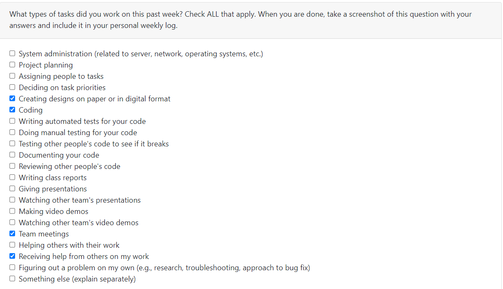

# Baz Sivakua Weekly Log
---
## Week 4
### September 25 - Octomber 1 2023
- This week I wokred with my team to write the project plan and made sure everyone was prepared to 
- The goals for this week complete the project plan and assign tasks. This was completed.
- I completed `Write Project Plan - Section 4, Teamwork Distribution and Anticipated Hurdles #8`, `Come up with specific project under Option 3 #2`, `Brainstorm Minimum Viable Product #3`, `Assign and Pick roles #10`, and `Transfer Project Plan into year-long project repository #9` this week.

### Picture of Project Board

### Picture of week 4's survey

---

## Week 5
### October 2 - October 8, 2023
- This week I worked with the team to get a general design aesthetic for the project and created a Figma design for request listings page
- The goals for this week was to start making designs for our web application in Figma
- I worked on `Create Figma design for Your Requests page` this week

### Picture of Project Board

### Picture of week 4's survey

---

## Week 6 and 7
### October 9 - October 22, 2023
- This week I worked on Milestone 2: Mini presentation, specifically with the goals of finishing the figma designs and starting to code the web application
- The milestone goals for this week was to finish our Figma designs and start setting up the enviroment for the web applications.

### Picture of Project Board

### Picture of week 4's survey

---

## 8
### October 23 - October 29, 2023
- This week I worked on Milestone 2: Mini presentation and some coding for Milestone 3: Design Submission.
- The goal for this week was to prepare for the presentation and write an About Us section for the web application. 

### Picture of Project Board

### Picture of week 4's survey

