# Jan-Yaeger Dhillon Weekly Log #

## Week 4 ##

### Applicable Date Range ###
October 9 2023 - Octomber 22 2023

### Tasks Worked On ###

Screenshot from peer eval:

- This week I worked on the Project Plan with my team.
- The goal for this week was to complete the project plan, which we did.
- I completed `Write Project Plan - Section 3, Technology Stack` and collaborated with my team on `Assign and Pick Roles` and `Brainstorm Minimum Viable Product`. I also stepped in to help with `Write Project Plan - Section 4, Teamwork Distribution and Anticipated Hurdles` and `Write Project Plan - Section 2, Major Milestones`.
- I did a lot of research and planning on the technologies and services we will be using.

Screenshot of Project Board:

### In Progress ###

None

### To Do ###

## Week 5 ##

### Applicable Date Range ###
October 1 - October 8, 2023

### Tasks Worked On ###

Screenshot from peer eval:

- Specifically from our project board, I completed `Design logo` and worked with my team to complete `Come up with name for the web-app` and `Fix Github branching issue`.
- Looking ahead, I intend to complete `Create Figma design for home page` in the very near future and start working on implementing the technologies such as `Set up Next.js for the project` and `Set up AWS Amplify for the project`.   
- This week I focused mainly on planning out how the application is going to work in terms of UI/UX. I created a logo and got a solid draft for the landing page on Figma and contributed to creating an identity for our project. I worked on researching the AWS services such as Amplify and how we can best implement them into our app.

### In Progress ###
- I am still working on the Figma design for the home page. I am also working on researching the AWS services and how we can best implement them into our app.

Screenshot of Project Board:

### To Do ###

- This week I intend to set up a lot of the base technologies for both teh front and back end of the web app, including configuring AWS Amplify and setting up Next.js. I also intend to complete the Figma design for the home page and start working on the actual implementation of the front end.

## Week 6 & 7 ##

### Applicable Date Range ###
October 9 - October 22, 2023

### Tasks Worked On ###

- My goals this week were to lay a strong foundation for the project and did a lot of work towards Milestone #2: Mini Presentation. 
- I finialized my design for the landing page on Figma and got a strong start on implementing it in Next. 
- Speaking of, I set up Next.js, Tailwind CSS, TypeScript, and the other front end technologies. 
- I also set up AWS Amplify for our project and hosted out web app (https://amplify.ds4nt6byy9rfg.amplifyapp.com/). However, I still have yet to fully set up the CLI and configure Amplify. 
- I also started looking into how I am going to implement Lambda, Step Functions, CodeBuild, and CodePipeline. 
- Behind the scenes, I have been learning a lot about Docker and containerization which will eventually come into play when we start to implement the video processing. I also attended all meetings and classes.
- I think I did well this week and aim to continue working hard to achieve optimal results.

Screenshot from peer eval for Week 6:

Screenshot from peer eval for Week 7:

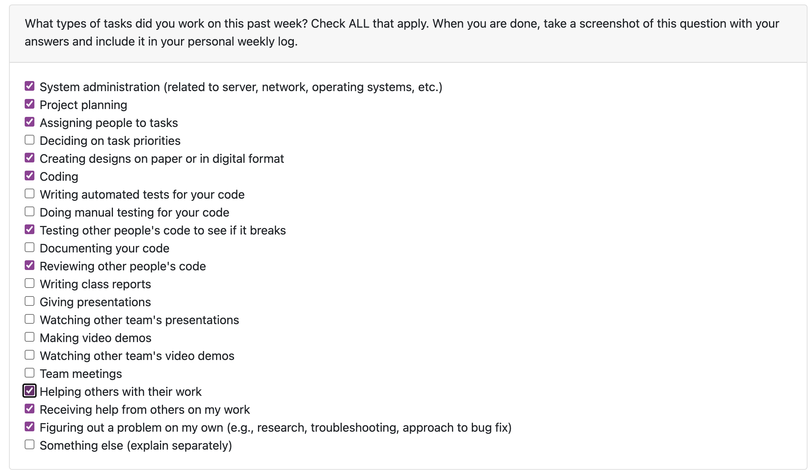

### Completed Tasks ###

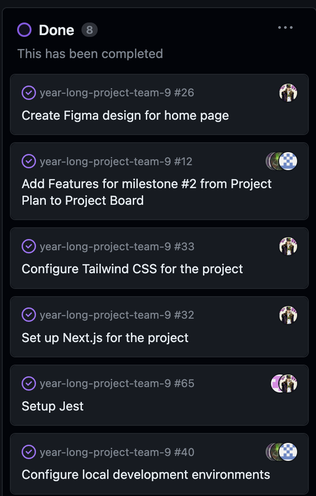

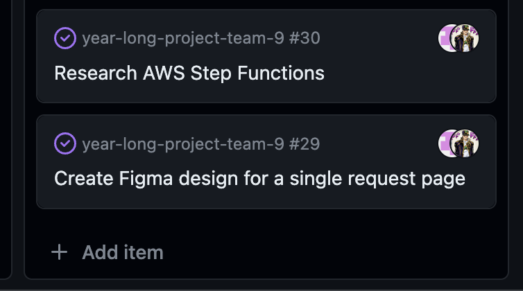

### In Progress ###

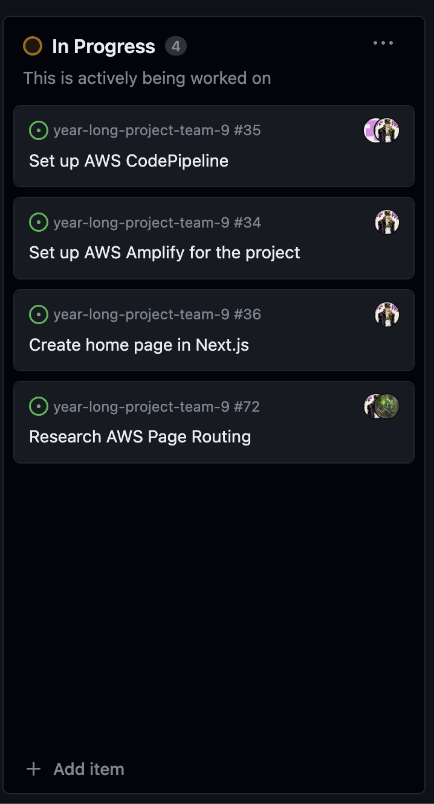

### To Do ###

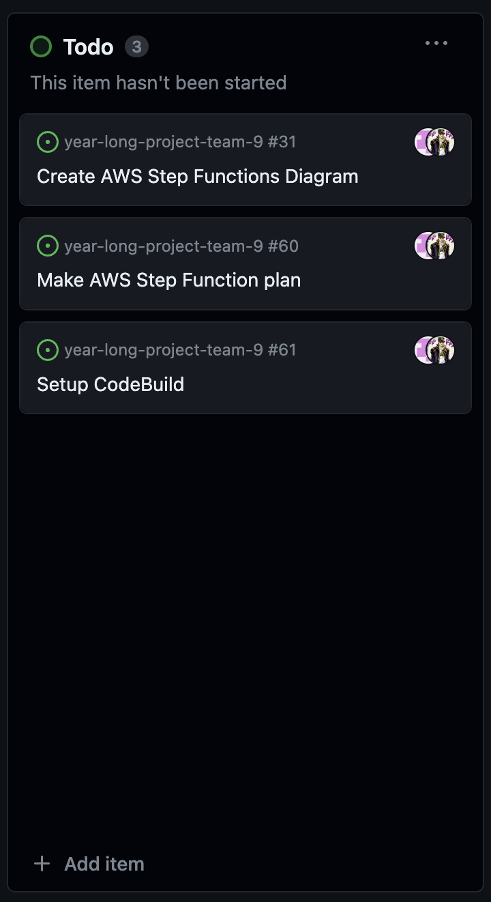

Screenshot of Project Board:

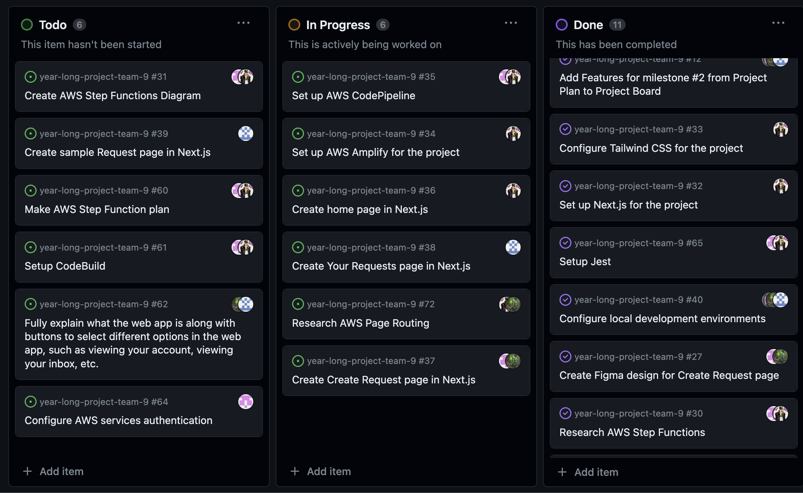

## Week 8 ##

### Applicable Date Range ###
October 23 - October 29, 2023

### Tasks Worked On ###

- My goal this week was to lay a strong foundation for the front-end and finish the home page of the web app, including the landing-page, features, and about sections.
- I finished the home page of the web app and implemented the design I created on Figma. I also set up the routing for the web app and created the features and about sections of the home page.
- I also started working on the video processing and researched how to implement the video processing using AWS Lambda, Step Functions, and CodePipeline.

Screenshot from peer eval for Week 8:

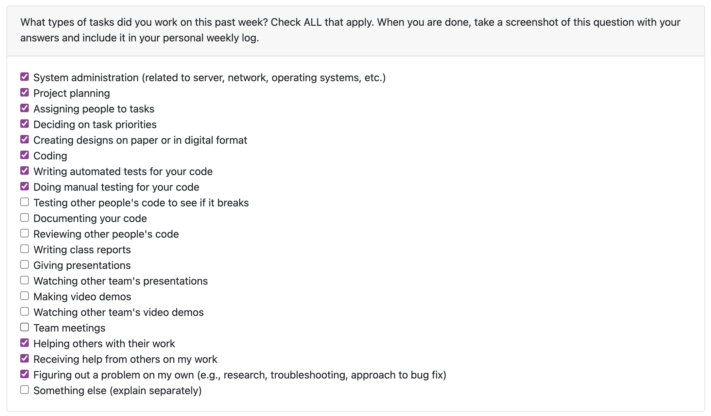

### Completed Tasks ###

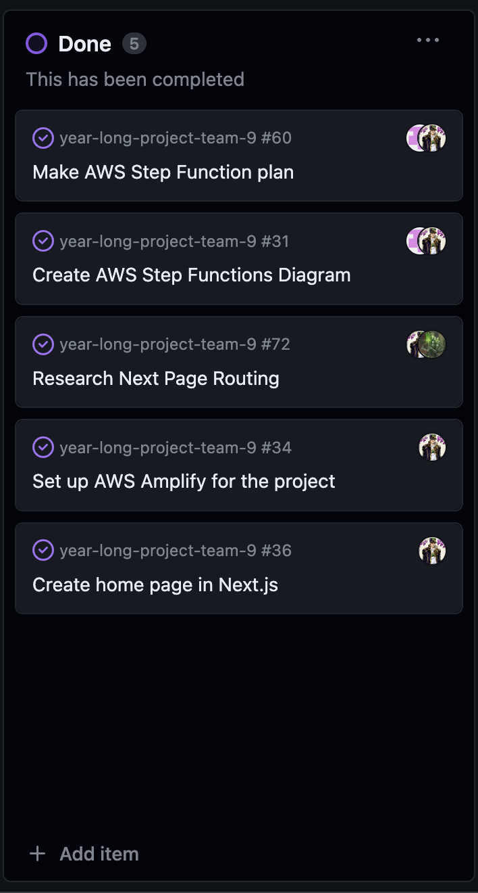

### In Progress ###

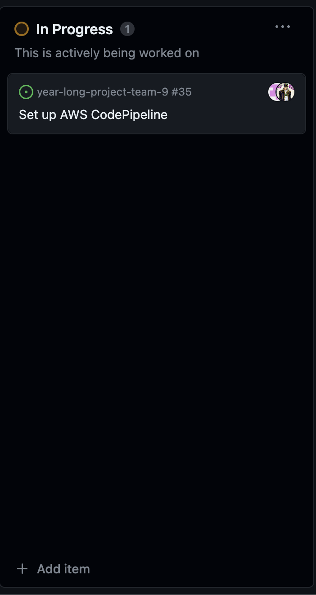

- Note that I am waiting to be authorized to use this.

### To Do ###

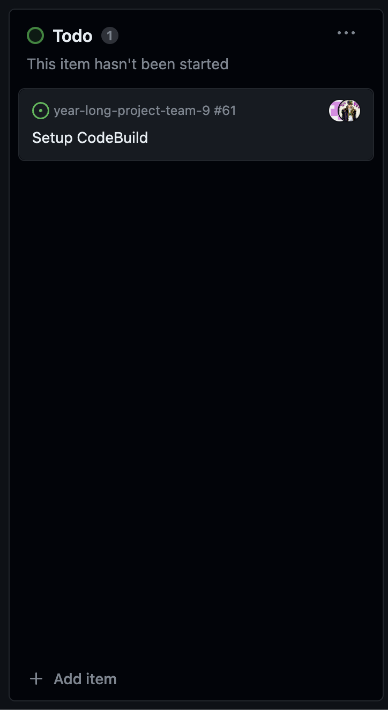

-Similarly, I am waiting to be authorized to use this.

Screenshot of Project Board:

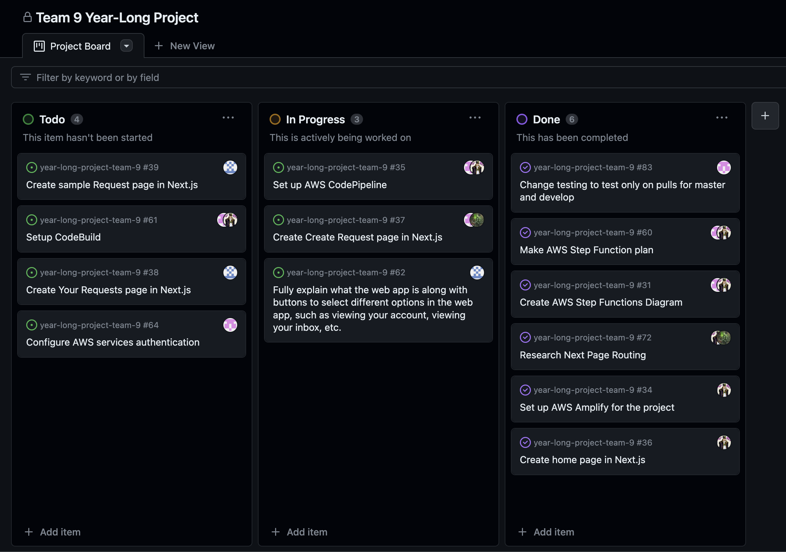

## Week 9 ##

### Applicable Date Range ###
October 24 - November 4, 2023

### Tasks Worked On ###

- My main goal for this week was to do well on the Mini Presentation, which I think we did. That included a lot of front-end coding and testing.
- My goal after the Mini Presentation was to start working on the system architecture and research how to implement the video processing using AWS Lambda, API Gateway and Step Functions.
- I have been doing a lot of research on Lambda and SST (Serverless Stack) to implement other AWS services with our app and begin creating our backend.
- I also touched up the home page including fixing spelling errors, increasing font sizes, and changing wording.

Screenshot from peer eval for Week 9:

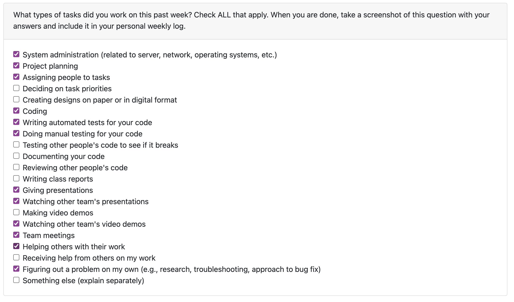

### Completed Tasks ###

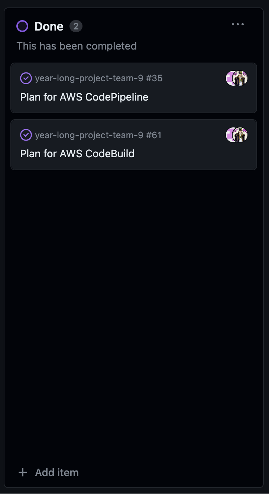

### In Progress ###

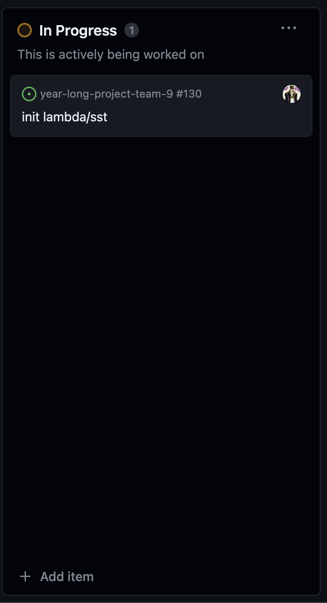

### To Do ###

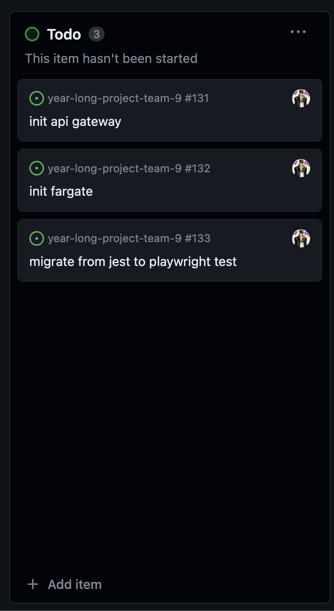

### Screenshot of Project Board:

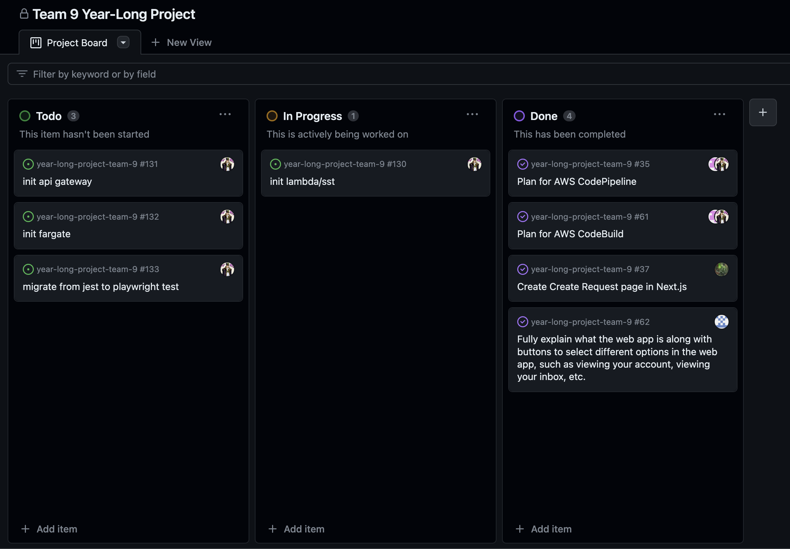

