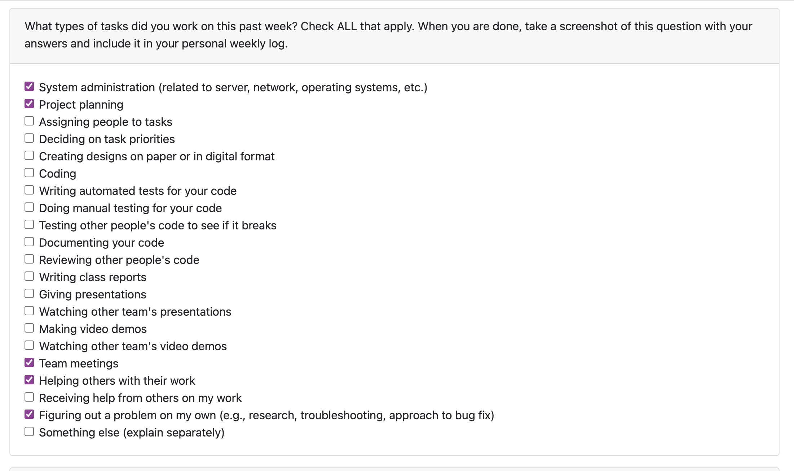
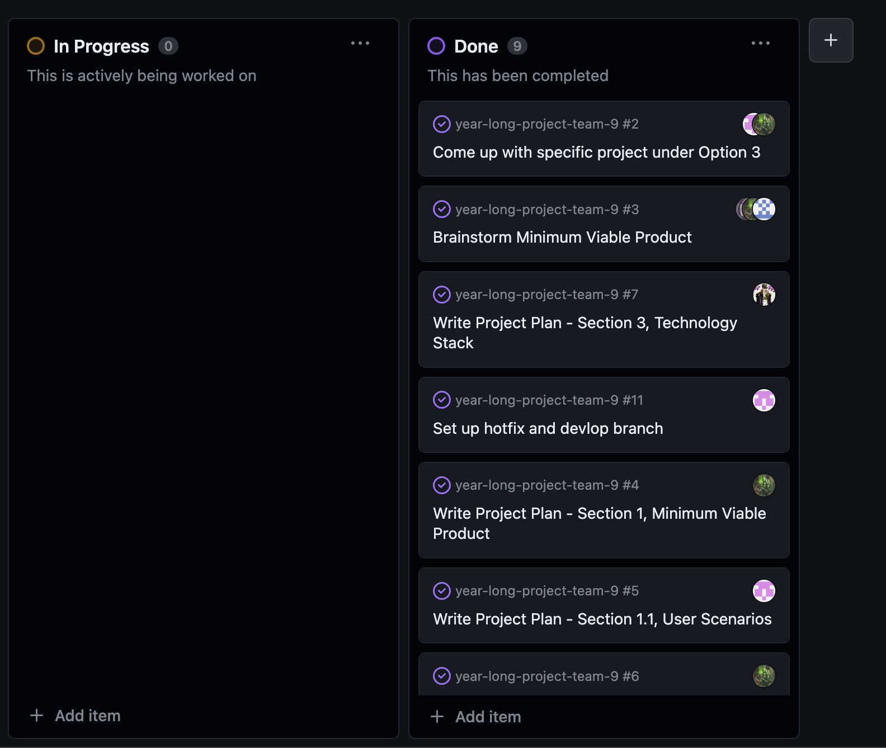

# Jan-Yaeger Dhillon Weekly Log #

## Week 4 ##

### Applicable Date Range ###
September 24 - October 1, 2023

### Tasks Worked On ###

Screenshot from peer eval:

- This week I worked on the Project Plan with my team.
- The goal for this week was to complete the project plan, which we did.
- I completed `Write Project Plan - Section 3, Technology Stack` and collaborated with my team on `Assign and Pick Roles` and `Brainstorm Minimum Viable Product`. I also stepped in to help with `Write Project Plan - Section 4, Teamwork Distribution and Anticipated Hurdles` and `Write Project Plan - Section 2, Major Milestones`.
- I did a lot of research and planning on the technologies and services we will be using.

Screenshot of Project Board:

assignee: 