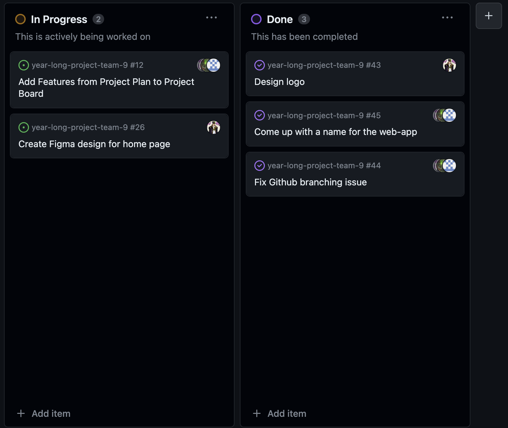
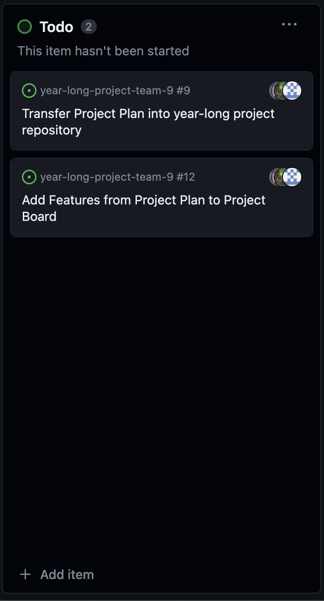

# Jan-Yaeger Dhillon Weekly Log #

## Week 4 ##

### Applicable Date Range ###
October 2 - October 2023

### Tasks Worked On ###

Screenshot from peer eval:

- This week I focused mainly on planning out how the application is going to work in terms of UI/UX. I created a logo and got a solid draft for the landing page on Figma and contributed to creating an identity for our project. I worked on researching the AWS services such as Amplify and how we can best implement them into our app.

Screenshot of Project Board:

### In Progress ###

None

### To Do ###

