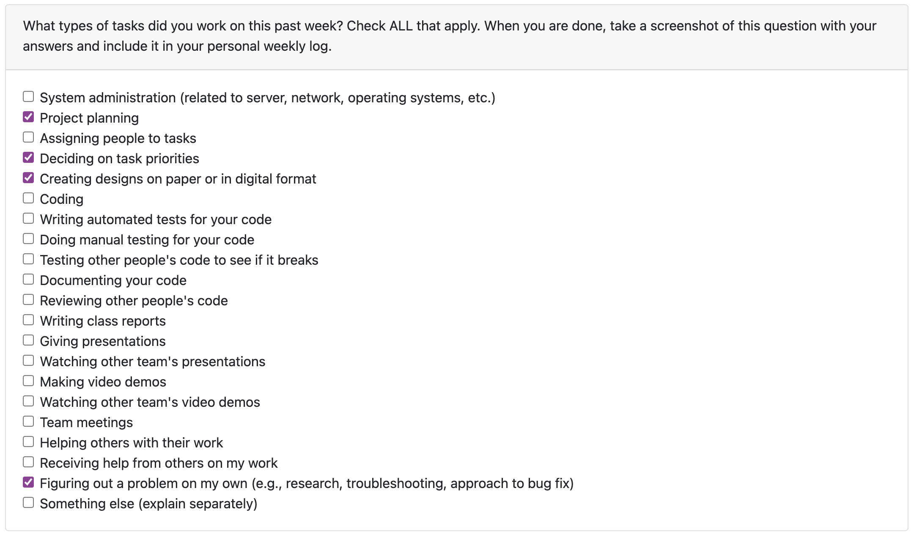
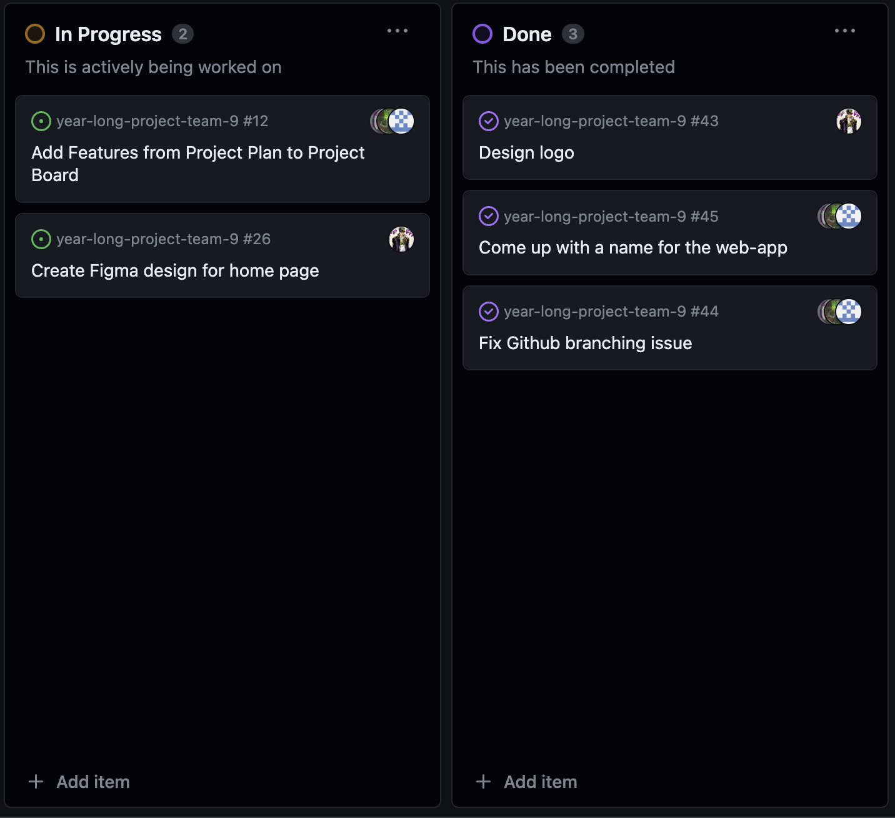
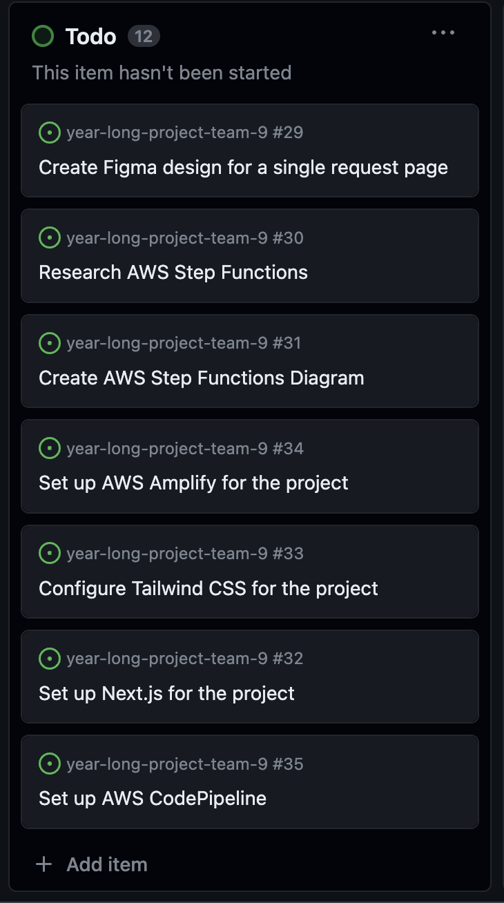

# Jan-Yaeger Dhillon Weekly Log #

## Week 4 ##

### Applicable Date Range ###
September 24 - October 1, 2023

### Tasks Worked On ###

Screenshot from peer eval:

- This week I worked on the Project Plan with my team.
- The goal for this week was to complete the project plan, which we did.
- I completed `Write Project Plan - Section 3, Technology Stack` and collaborated with my team on `Assign and Pick Roles` and `Brainstorm Minimum Viable Product`. I also stepped in to help with `Write Project Plan - Section 4, Teamwork Distribution and Anticipated Hurdles` and `Write Project Plan - Section 2, Major Milestones`.
- I did a lot of research and planning on the technologies and services we will be using.

Screenshot of Project Board:

### In Progress ###

None

### To Do ###

## Week 5 ##

### Applicable Date Range ###
October 1 - October 8, 2023

### Tasks Worked On ###

Screenshot from peer eval:

- Specifically from our project board, I completed `Design logo` and worked with my team to complete `Come up with name for the web-app` and `Fix Github branching issue`.
- Looking ahead, I intend to complete `Create Figma design for home page` in the very near future and start working on implementing the technologies such as `Set up Next.js for the project` and `Set up AWS Amplify for the project`.   
- This week I focused mainly on planning out how the application is going to work in terms of UI/UX. I created a logo and got a solid draft for the landing page on Figma and contributed to creating an identity for our project. I worked on researching the AWS services such as Amplify and how we can best implement them into our app.

### In Progress ###
- I am still working on the Figma design for the home page. I am also working on researching the AWS services and how we can best implement them into our app.

Screenshot of Project Board:

### To Do ###

- This week I intend to set up a lot of the base technologies for both teh front and back end of the web app, including configuring AWS Amplify and setting up Next.js. I also intend to complete the Figma design for the home page and start working on the actual implementation of the front end.

