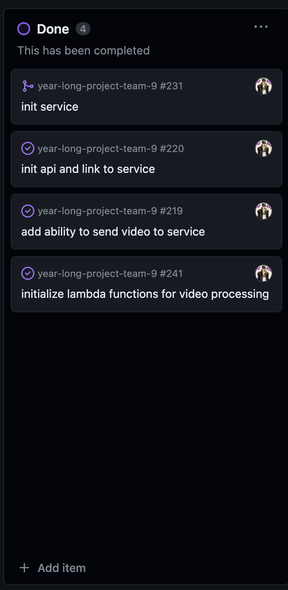
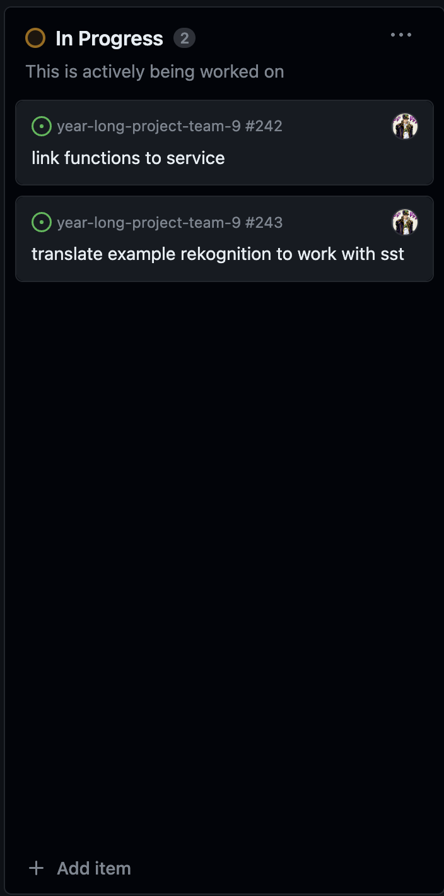
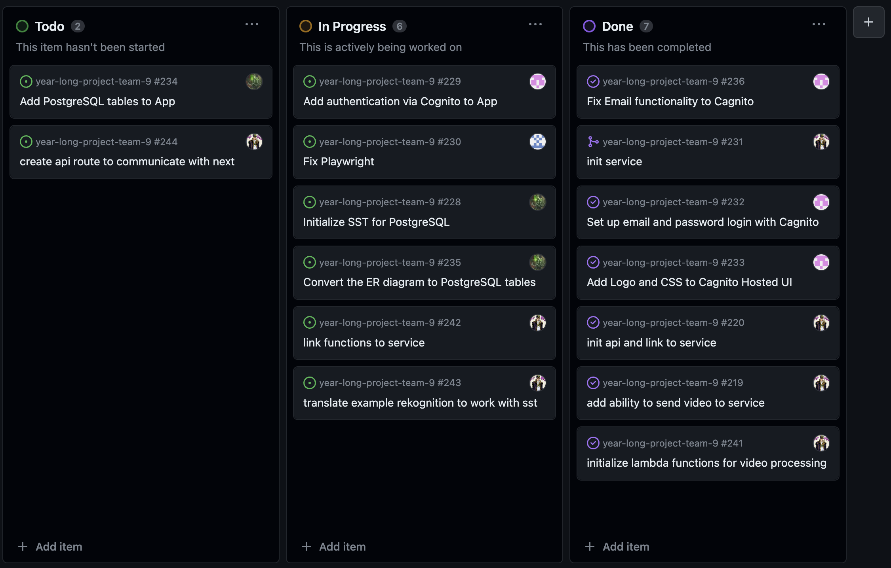
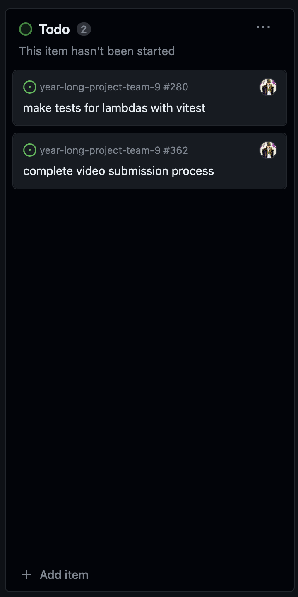
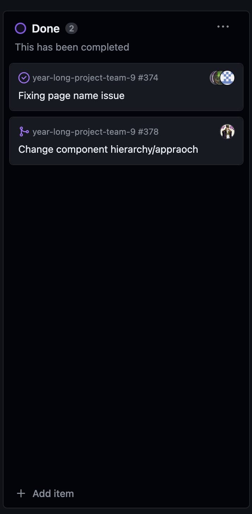
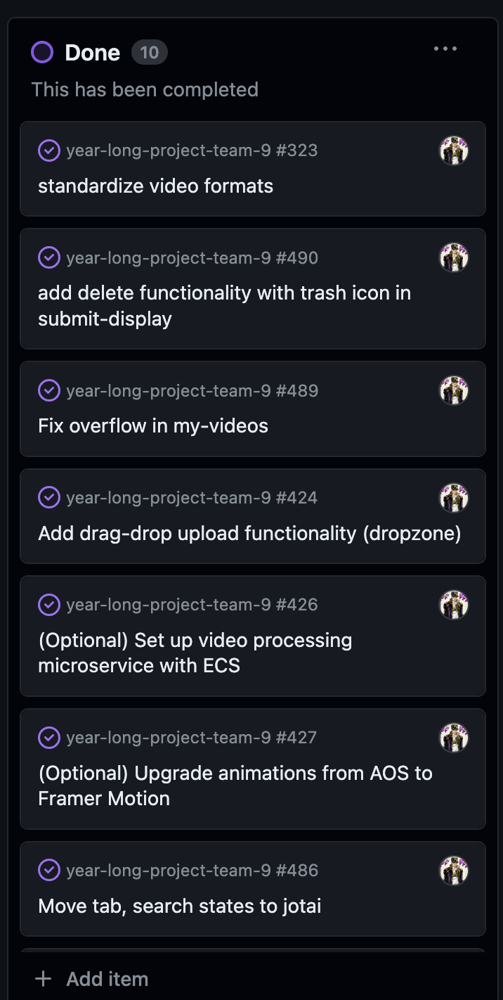

# Jan-Yaeger Dhillon Weekly Log #

## Week 4 ##

### Applicable Date Range ###
October 9 2023 - Octomber 22 2023

### Tasks Worked On ###

Screenshot from peer eval:

- This week I worked on the Project Plan with my team.
- The goal for this week was to complete the project plan, which we did.
- I completed `Write Project Plan - Section 3, Technology Stack` and collaborated with my team on `Assign and Pick Roles` and `Brainstorm Minimum Viable Product`. I also stepped in to help with `Write Project Plan - Section 4, Teamwork Distribution and Anticipated Hurdles` and `Write Project Plan - Section 2, Major Milestones`.
- I did a lot of research and planning on the technologies and services we will be using.

Screenshot of Project Board:

### In Progress ###

None

### To Do ###

## Week 5 ##

### Applicable Date Range ###
October 1 - October 8, 2023

### Tasks Worked On ###

Screenshot from peer eval:

- Specifically from our project board, I completed `Design logo` and worked with my team to complete `Come up with name for the web-app` and `Fix Github branching issue`.
- Looking ahead, I intend to complete `Create Figma design for home page` in the very near future and start working on implementing the technologies such as `Set up Next.js for the project` and `Set up AWS Amplify for the project`.
- This week I focused mainly on planning out how the application is going to work in terms of UI/UX. I created a logo and got a solid draft for the landing page on Figma and contributed to creating an identity for our project. I worked on researching the AWS services such as Amplify and how we can best implement them into our app.

### In Progress ###
- I am still working on the Figma design for the home page. I am also working on researching the AWS services and how we can best implement them into our app.

Screenshot of Project Board:

### To Do ###

- This week I intend to set up a lot of the base technologies for both teh front and back end of the web app, including configuring AWS Amplify and setting up Next.js. I also intend to complete the Figma design for the home page and start working on the actual implementation of the front end.

## Week 6 & 7 ##

### Applicable Date Range ###
October 9 - October 22, 2023

### Tasks Worked On ###

- My goals this week were to lay a strong foundation for the project and did a lot of work towards Milestone #2: Mini Presentation.
- I finialized my design for the landing page on Figma and got a strong start on implementing it in Next.
- Speaking of, I set up Next.js, Tailwind CSS, TypeScript, and the other front end technologies.
- I also set up AWS Amplify for our project and hosted out web app (https://amplify.ds4nt6byy9rfg.amplifyapp.com/). However, I still have yet to fully set up the CLI and configure Amplify.
- I also started looking into how I am going to implement Lambda, Step Functions, CodeBuild, and CodePipeline.
- Behind the scenes, I have been learning a lot about Docker and containerization which will eventually come into play when we start to implement the video processing. I also attended all meetings and classes.
- I think I did well this week and aim to continue working hard to achieve optimal results.

Screenshot from peer eval for Week 6:

Screenshot from peer eval for Week 7:

### Completed Tasks ###

### In Progress ###

### To Do ###

Screenshot of Project Board:

## Week 8 ##

### Applicable Date Range ###
October 23 - October 29, 2023

### Tasks Worked On ###

- My goal this week was to lay a strong foundation for the front-end and finish the home page of the web app, including the landing-page, features, and about sections.
- I finished the home page of the web app and implemented the design I created on Figma. I also set up the routing for the web app and created the features and about sections of the home page.
- I also started working on the video processing and researched how to implement the video processing using AWS Lambda, Step Functions, and CodePipeline.

Screenshot from peer eval for Week 8:

### Completed Tasks ###

### In Progress ###

- Note that I am waiting to be authorized to use this.

### To Do ###

-Similarly, I am waiting to be authorized to use this.

Screenshot of Project Board:

## Week 9 ##

### Applicable Date Range ###
October 30 - November 5, 2023

### Tasks Worked On ###

- My main goal for this week was to do well on the Mini Presentation, which I think we did. That included a lot of front-end coding and testing.
- My goal after the Mini Presentation was to start working on the system architecture and research how to implement the video processing using AWS Lambda, API Gateway and Step Functions.
- I have been doing a lot of research on Lambda and SST (Serverless Stack) to implement other AWS services with our app and begin creating our backend.
- I also touched up the home page including fixing spelling errors, increasing font sizes, and changing wording.

Screenshot from peer eval for Week 9:

### Completed Tasks ###

### In Progress ###

### To Do ###

### Screenshot of Project Board:

## Week 10 ##

### Applicable Date Range ###
November 6 - November 12, 2023

### Tasks Worked On ###

- My main goal for this week was to test out SST and get several different AWS services working together in our Next app.
- Because we are now using SST + OpenNext, we can use NextJs' built in API routing among other things, so we have decided to migrate our front-end to using the NextJs app router, as opposed to the pages router we have been using.

- Another thing I am working on and plan to complete next week is making the home page responsive and mobile friendly. I've been smart about the design choices meaning it will not be super difficult but some changes are needed (a lot of changing col -> row).

- I also started working on the system architecture and research how to implement the video processing using AWS Lambda, API Gateway and Step Functions. I completed a diagram detailing how this will play out in terms of the AWS services. This week I hope to flesh it out more.

- Another goal for next week is to start working on the video submission pages. Another reason I want to use the app router instead of the pages router is because of the ability to create nested layouts, as this marks the divergence of our two main views of the app (home and submit).

Screenshot from peer eval for Week 10:

### Completed Tasks ###

### In Progress ###

### To Do ###

### Screenshot of Project Board:

## Week 11 & 12 ##

### Applicable Date Range ###
November 13 - November 26, 2023

### Tasks Worked On ###

- My main goal this week was to finish the system architecture and research how to implement the video processing with SST most effectively.
- Another goal for this week was to start working on the video submission pages, which I did.
- This week I hope to finalize my work for the milestone and have a solid start on getting the container working with Fargate and ECS.

Screenshot from peer eval for Week 10:

### Completed Tasks ###

### In Progress ###

### To Do ###

### Screenshot of Project Board:

-------------

# Term 2

## Week 1 (Week 13) ##

### Applicable Date Range ###
January 8 - January 14, 2024

### Tasks Worked On ###

- My main goal this week was to get a really good handle on the video processing, as I will be spearheading this

- I set up the containerized service on ECS that can be used to handle the video processing

- I used the example from AWS to blur faces in videos to learn about Lambda functions and initialize integrating them into our own app

- Because we are using SST, I have been researching the Function constructs to use with Lambda

- I initialized the API (with the Api construct) that will be used to create routes for the backend (database, communicating with Next.js, etc.)

- This week I hope to get more Lambda functions working with the containerized service.

Screenshot from peer eval for Week 1:

### Completed Tasks ###

### In Progress ###

### To Do ###

### Screenshot of Project Board:

## Week 2  ##

### Applicable Date Range ###
January 15 - January 21, 2024

### Tasks Worked On ###

- This week I got the video processing working using Lambda and Step Functions.
- Now we can take videos from S3 and apply the face blurring
- My goal this week is to update the front end and make everything work together in preparation for the peer testing
- This week I need to clean everything up and make some tests as well, however it is hard to test some of the AWS services
- However, I have set up Vitest for testing SST

Screenshot from peer eval for Week 2:

### Completed Tasks ###

### In Progress ###

### To Do ###

### Screenshot of Project Board:

## Week 3 ##

### Applicable Date Range ###
January 22 - January 28, 2024

### Tasks Worked On ###

- This week I focused on getting everything functional for the Peer Testing.
- I was able to get the video processing working with ECS but I wasn't able to reliably send jobs from Next.js, so for now I have used the Job construct to run the container, which works well.
- I linked the upload process to the Job and now videos uploaded will start processing!
- I also put a lot of effort into designing the video submission page, but I realized that given the slowness of the video processing, it makes more sense to simply notify the user that the video has been updated, and then have a separate "dashboard" view to view the status.
- To accomodate this dashboard view, I found a really good example to base on but it requires the App router for Next.js, so I also migrated our project to that.
- This week I hope to smoothen out the video processing process and complete the video submission UI.
- I also need to find a way to convert videos recorded in the browser (.webm) to .mp4 so they can be fed to Rekognition.
- I put in a lot of work this week and think I deserve bonus marks.

Screenshot from peer eval for Week 3:

### Completed Tasks ###

### In Progress ###

### To Do ###

### Screenshot of Project Board:

## Week 4 ##

### Applicable Date Range ###
January 29 - February 4, 2024

### Tasks Worked On ###

- This week for me was all about overhauling the user experience and evaluating the peer feedback so we set this milestone off on the right foot.
- I also migrated the project to using React Server Components to speed things up and make the data fetching more intuitive.
- I spent a lot of time setting up the new "dashboard" view for when the user is signed in, and integrating the database with API routes
- This week I hope to finish the video submissions process and start finalizing the UI.
- I put in a lot of work this week and did a lot of planning so I think I deserve bonus marks.

Screenshot from peer eval for Week 4:

### Completed Tasks ###

### In Progress ###

### To Do ###

### Screenshot of Project Board:

## Week 5 ##

### Applicable Date Range ###
February 4 - February 11, 2024

### Tasks Worked On ###

- This week I mainly focused on setting a very malleable and agnostic layout for the project. I had to revamp how we were fetching data as it was causing a waterfall effect and I figured it's best to let the individual components fetch their own data.
- I gave my team presentations on how to navigate the new structure as well as how to test better with Playwright.
- This week I hope to finish working on the UI.

Screenshot from peer eval for Week 5:

### Completed Tasks ###

### In Progress ###

### To Do ###

### Screenshot of Project Board:

## Week 6 ##

### Applicable Date Range ###
February 11 - February 18, 2024

### Tasks Worked On ###

- This week included a lot of testing, fixes, and careful planning. I wrote some tests for some of the Lambdas and set up the routing based around dynamic routes.
- I worked on making the database use camelCase instead of snake_case and created some Lambda routes to update and retrieve the status of the video processing.
- I have been learning a lot about Next.js so I can use it optimally. My team and I have been discussing using the URL for more state management.
- I am working on getting the dynamic routes with a proper default working for submissions and requests.
- I have also been working on a function to convert .webm to .mp4 but it is looking to be a more involved process then I thought.
- This week will be a lot of cleaning up and I hope to finish the foundation.

Screenshot from peer eval for Week 6:

### Completed Tasks ###

### In Progress ###

### To Do ###

### Screenshot of Project Board:

## Week 7 ##

### Applicable Date Range ###
February 18 - February March 3, 2024

### Tasks Worked On ###

- This week I mainly focused on the upload/submissions/video side of things on both the front and back ends.
- I did a lot of work on integrating the submissions and uploading process into the new UI and integrating the new server action functions to replace the API routes.
- I also did research and debugging for the actual video processing and plan to do even more this week.
- I also added a new "videos" section for request/submit to show the current submissions.
- There are some bugs I am aware of so I want to squash them this week.
- I also want to add drag-and-drop functionality for uploads and look into making the video processing container a microservice.

Screenshot from peer eval for Week 7:

### Completed Tasks ###

### In Progress ###

### To Do ###

### Screenshot of Project Board:

## Week 9 ##

### Applicable Date Range ###
March 3 -  March 10, 2024

### Tasks Worked On ###

- This week I did a lot of work on the uploading side of things, including working on making recording and uploading files update the statuses of the submissions.
- I made several server-side functions to manage the uploads, downloads, and status of the submissions, as well as trigger the video processing job.
- I have been doing a lot of research and experimenting with creating a microservice on ECS with FastAPI to handle the video processsing instead of the Job that we are currently using. The Job does work but I want to get the microservice working. But it is not working yet.
- I have been doing a lot of UI cleaning up and debugging now that the core is done, but there is still more work to be done.
- This week was also the peer testing but honestly there were not many surprises and I feel like our team knows what needs to be done to complete the project.
- Note that I did fix several bugs this week but I still ahve work to do on the uploading process. However, I am makign good progress.

Screenshot from peer eval for Week 9:

### Completed Tasks ###

### In Progress ###

### To Do ###

### Screenshot of Project Board:

## Week 10 ##

### Applicable Date Range ###
March 11 -  March 17, 2024

### Tasks Worked On ###

- This week I focused on refining the uploading process and did a lot of work on that front.
- A major hurdle is managing the videos that are recorded in the browser but I'm close.
- This week I also did more work on the request lifecycle, adding uddate status functions and adding getDownloadPresignedUrl to eventually allow the user to download the processed video through the UI.
- I also did some UI work with Soren to make sure the entire panels are not scrollable, rather only the list items
- I am trying to get the theme switcher to be a simple button rather than a dropdown but I've yet to figure out how to get around the hydration errors it creates.
- This coming week I hope to finish Submit and my part of the project as a whole.

Screenshot from peer eval for Week 10:

### Completed Tasks ###

### In Progress ###

### To Do ###

### Screenshot of Project Board:

## Week 11 ##

### Applicable Date Range ###
March 18 -  March 24, 2024

### Tasks Worked On ###

- This week was all about cleaning things up, and I think I did a good job. The video processing pipeline is quite smooth now, and the UI is stable and responsive.
- One big hurdle I overcame this week was seeting up a WebSocket API endpoint for updating the status of submissions. Using this in combination with a refactoring of Submit, I am now able to update the status of requests/submissions without refreshing the page.
- To be honest though, I am investigating some other state management solutions like React Query. It seems upating the UI on the server is a bit of a weakspot for Next.js and my solution definitely works, but I would prefer a more optimized solution.
- However, there is still much to be done before we finish the term so this week will be a lot of work as well.

Screenshot from peer eval for Week 10:

### Completed Tasks ###

### In Progress ###

### To Do ###

### Screenshot of Project Board:

## Week 12 ##

### Applicable Date Range ###
March 24 -  March 31, 2024

### Tasks Worked On ###

- I got a lot done this week across the stack. I finally set up my FastAPI microservice on ECS, added real-time notification and status updating, fixed a lot of bugs, and made a lot of UI improvements. I also redisgned how data is fetched so that all the necessary data for a user is fetched when they first go to submit, that way I can avoid additional function calls in the future.
- This week I basically glued everything together, so now I just need to fix some bugs and standardize things across the app and not just what I worked on.
- I think I deserve bonus marks for my contributions this week, I really did put in a massive amount of work.

Screenshot from peer eval for Week 12:

### Completed Tasks ###

### In Progress ###

### To Do ###

### Screenshot of Project Board:

## Week 13 ##

### Applicable Date Range ###
March 31 -  April 7, 2024

### Tasks Worked On ###

- This was the last week so I was just finishing up everything.
- There were many many many bugs that needed to be fixed across the stack and I worked tirelessly this week at the cost of my own mental health.
- I believe I am eligible for bonus marks for this week's contirbutions.

### Screenshot of Project Board:

