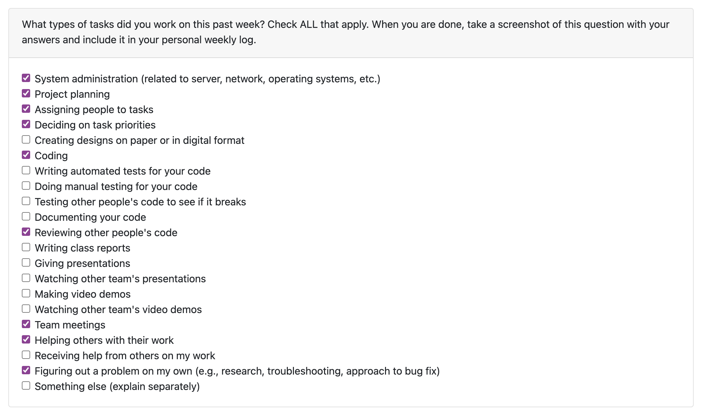

# Jan-Yaeger Dhillon Weekly Log #

## Week 4 ##

### Applicable Date Range ###
October 9 2023 - Octomber 22 2023

### Tasks Worked On ###

Screenshot from peer eval:

- This week I worked on the Project Plan with my team.
- The goal for this week was to complete the project plan, which we did.
- I completed `Write Project Plan - Section 3, Technology Stack` and collaborated with my team on `Assign and Pick Roles` and `Brainstorm Minimum Viable Product`. I also stepped in to help with `Write Project Plan - Section 4, Teamwork Distribution and Anticipated Hurdles` and `Write Project Plan - Section 2, Major Milestones`.
- I did a lot of research and planning on the technologies and services we will be using.

Screenshot of Project Board:

### In Progress ###

None

### To Do ###

## Week 5 ##

### Applicable Date Range ###
October 1 - October 8, 2023

### Tasks Worked On ###

Screenshot from peer eval:

- Specifically from our project board, I completed `Design logo` and worked with my team to complete `Come up with name for the web-app` and `Fix Github branching issue`.
- Looking ahead, I intend to complete `Create Figma design for home page` in the very near future and start working on implementing the technologies such as `Set up Next.js for the project` and `Set up AWS Amplify for the project`.   
- This week I focused mainly on planning out how the application is going to work in terms of UI/UX. I created a logo and got a solid draft for the landing page on Figma and contributed to creating an identity for our project. I worked on researching the AWS services such as Amplify and how we can best implement them into our app.

### In Progress ###
- I am still working on the Figma design for the home page. I am also working on researching the AWS services and how we can best implement them into our app.

Screenshot of Project Board:

### To Do ###

- This week I intend to set up a lot of the base technologies for both teh front and back end of the web app, including configuring AWS Amplify and setting up Next.js. I also intend to complete the Figma design for the home page and start working on the actual implementation of the front end.

## Week 6 & 7 ##

### Applicable Date Range ###
October 9 - October 22, 2023

### Tasks Worked On ###

- My goals this week were to lay a strong foundation for the project and did a lot of work towards Milestone #2: Mini Presentation. 
- I finialized my design for the landing page on Figma and got a strong start on implementing it in Next. 
- Speaking of, I set up Next.js, Tailwind CSS, TypeScript, and the other front end technologies. 
- I also set up AWS Amplify for our project and hosted out web app (https://amplify.ds4nt6byy9rfg.amplifyapp.com/). However, I still have yet to fully set up the CLI and configure Amplify. 
- I also started looking into how I am going to implement Lambda, Step Functions, CodeBuild, and CodePipeline. 
- Behind the scenes, I have been learning a lot about Docker and containerization which will eventually come into play when we start to implement the video processing. I also attended all meetings and classes.
- I think I did well this week and aim to continue working hard to achieve optimal results.

Screenshot from peer eval for Week 6:

Screenshot from peer eval for Week 7:

### Completed Tasks ###

### In Progress ###

### To Do ###

Screenshot of Project Board:

## Week 8 ##

### Applicable Date Range ###
October 23 - October 29, 2023

### Tasks Worked On ###

- My goal this week was to lay a strong foundation for the front-end and finish the home page of the web app, including the landing-page, features, and about sections.
- I finished the home page of the web app and implemented the design I created on Figma. I also set up the routing for the web app and created the features and about sections of the home page.
- I also started working on the video processing and researched how to implement the video processing using AWS Lambda, Step Functions, and CodePipeline.

Screenshot from peer eval for Week 8:

### Completed Tasks ###

### In Progress ###

- Note that I am waiting to be authorized to use this.

### To Do ###

-Similarly, I am waiting to be authorized to use this.

Screenshot of Project Board:

## Week 9 ##

### Applicable Date Range ###
October 30 - November 5, 2023

### Tasks Worked On ###

- My main goal for this week was to do well on the Mini Presentation, which I think we did. That included a lot of front-end coding and testing.
- My goal after the Mini Presentation was to start working on the system architecture and research how to implement the video processing using AWS Lambda, API Gateway and Step Functions.
- I have been doing a lot of research on Lambda and SST (Serverless Stack) to implement other AWS services with our app and begin creating our backend.
- I also touched up the home page including fixing spelling errors, increasing font sizes, and changing wording.

Screenshot from peer eval for Week 9:

### Completed Tasks ###

### In Progress ###

### To Do ###

### Screenshot of Project Board:

## Week 10 ##

### Applicable Date Range ###
November 6 - November 12, 2023

### Tasks Worked On ###

- My main goal for this week was to test out SST and get several different AWS services working together in our Next app.
- Because we are now using SST + OpenNext, we can use NextJs' built in API routing among other things, so we have decided to migrate our front-end to using the NextJs app router, as opposed to the pages router we have been using.

- Another thing I am working on and plan to complete next week is making the home page responsive and mobile friendly. I've been smart about the design choices meaning it will not be super difficult but some changes are needed (a lot of changing col -> row).

- I also started working on the system architecture and research how to implement the video processing using AWS Lambda, API Gateway and Step Functions. I completed a diagram detailing how this will play out in terms of the AWS services. This week I hope to flesh it out more.

- Another goal for next week is to start working on the video submission pages. Another reason I want to use the app router instead of the pages router is because of the ability to create nested layouts, as this marks the divergence of our two main views of the app (home and submit).

Screenshot from peer eval for Week 10:

### Completed Tasks ###

### In Progress ###

### To Do ###

### Screenshot of Project Board:

## Week 11 & 12 ##

### Applicable Date Range ###
November 13 - November 26, 2023

### Tasks Worked On ###

- My main goal this week was to finish the system architecture and research how to implement the video processing with SST most effectively.
- Another goal for this week was to start working on the video submission pages, which I did.
- This week I hope to finalize my work for the milestone and have a solid start on getting the container working with Fargate and ECS.

Screenshot from peer eval for Week 10:

### Completed Tasks ###

### In Progress ###

### To Do ###

### Screenshot of Project Board:

## Week 13 ##

### Applicable Date Range ###
November 17 - December 3, 2023

### Tasks Worked On ###

- My main goal this week was to work on and finish the design submission document and the video, which involved finishing the system architecture diagram and creating a video to go along with it.
- Another goal for this week was to start working on the video submission pages, which I did.
- This week I hope to finalize my work for the milestone and have a solid start on getting the container working with Fargate and ECS.

Screenshot from peer eval for Week 13:

### Completed Tasks ###

### In Progress ###

### To Do ###

### Screenshot of Project Board:

