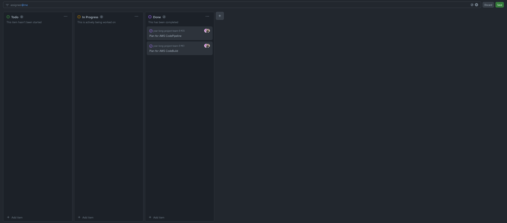

# Muhammad Bakar Weekly Log
---
## Week 4
### September 25 - Octomber 1 2023
- This week I completed the project plan along side my team.
- The goals for this week complete the project plan, which was achieved.
- I completed `Write Project Plan - Section 1.1, User Scenarios #5`, `Set up hotfix and devlop branch #11`, `Come up with specific project under Option 3 #2`, `Brainstorm Minimum Viable Product #3`, `Assign and Pick roles #10`, and `Transfer Project Plan into year-long project repository #9`. 
### Picture of Project Board

### Picture of week 4's survey

---

## Week 5
### October 2 2023 - Octomber 8 2023
- This week I worte the team weekly log. Additionally, I helpe come up with the name for the web-app.
	- I did: 'Come up with a name for the web-app' and 'Fix Github branching issue'
- Additionally, I attend class, and another group meeting
### Picture of Project Board Week 5 

### Picture of Week 5's Survey

## Week 6 and 7
### October 9 2023 - Octomber 22 2023
- These past two weeks I worked on Milestone #2: Mini-Presentation, and began thinking about authentication, a goal in Milestone #3: Design Submission.
- The goals for the past two weeks was to create my figma design and setup Jest, which in turn meant setting up automated testing. All goals were completed.
- Additionally, I attend class, and all other group meeting
### Picture of Project Board Week 6 and 7

### Picture of Week 6's and 7's Survey

## Week 8
### October 23 2023 - October 29 2023
- I worked on Milestone #2: Mini-Presentation, and laid out plans for authentication, since the group wanted to talk a little bit about it in the presentation.
- My goals for this week was to make sure everyone was on track to complete their work, so that we are ready for the presentation. Happy to say said goal was completed, and everyone is on track to complete the their work for the presentation.
- I also attend class, and all other group meetings.
### Picture of Project Board Week 8

### Picture of Week 8's Survey

## Week 9
### October 30 2023 - November 5 2023
- I worked on Milestone #2: Mini-Presentation. 
- My goals for this week was to make sure Milestone #2: Mini-Presentation was completed. Although our demo broke, even though everything indicated it would not, I think the goal was completed.
- I also attended Tuesday’s class, and all other group meetings.
### Picture of Project Board Week 9

### Picture of Week 9's Survey

## Week 10
### November 6 2023 - November 12 2023
- I worked on Milestone #3: Design Submission. 
- My goals for this weeks was to get on the same page with the group on milestone #3 and complete the fixes for the Create Request page.
	- I got on the same page regarding milestone #3, but failed to complete Create Request because my partner become ill. However, I made considerable progress towards fixing the page. 
- I also attended Tuesday’s class, and all other group meetings.
### Picture of Project Board Week 10

### Picture of Week 10's Survey

## Week 12
### November 20 2023 - November 26 2023
- I worked on Milestone #3: Design Submission. 
- My goals for this weeks was to get Cognito (Authentication) set up and linked to the app. Which I did. See `Dashboard.tsx` (and tests for Dashboard.tsx).
- I also attended Thursday's class, and all other group meetings.
### Picture of Project Board Week 12

### Picture of Week 12's Survey

## Week 13
### November 27 2023 - December 03 2023
- I worked on Milestone #3: Design Submission. 
- My goals for this weeks was to make the ER diagram and add the database tables. I completed my goals. 

- I also attended Tuesday's class, and all other group meetings.
### Picture of Project Board Week 13

### Picture of Week 13's Survey
