# Soren Stenback Weekly Log

---

## Week 4

### September 25 - October 1, 2023

- This week I completed the project plan alongside my team members.
- The goals for this week complete the project plan, which was achieved. We completed making the project plan and transcribing it to our repo.
- I completed `Assign and Pick roles`, `Brainstorm Minimum Viable Product`, `Come up with specific project under Option 3`, `Write Project Plan - Section 1, Minimum Viable Product`, and `Write Project Plan - Section 2, Major Milestones`. 

### Picture of Project Board

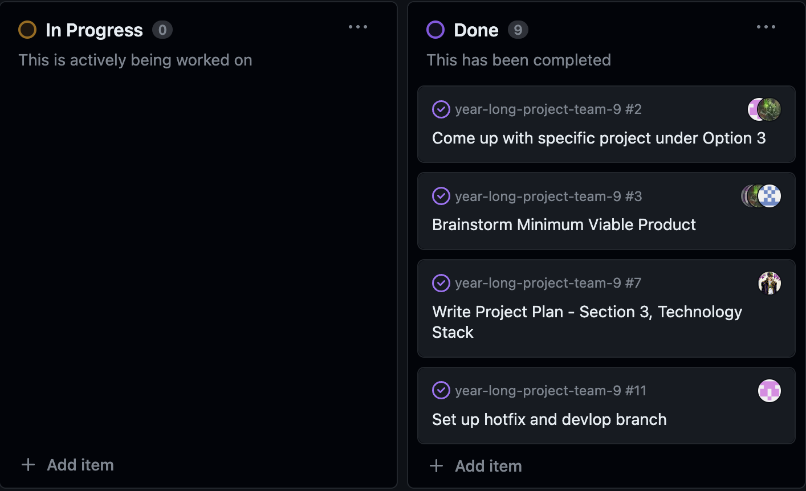

### Picture of Week 4's Survey

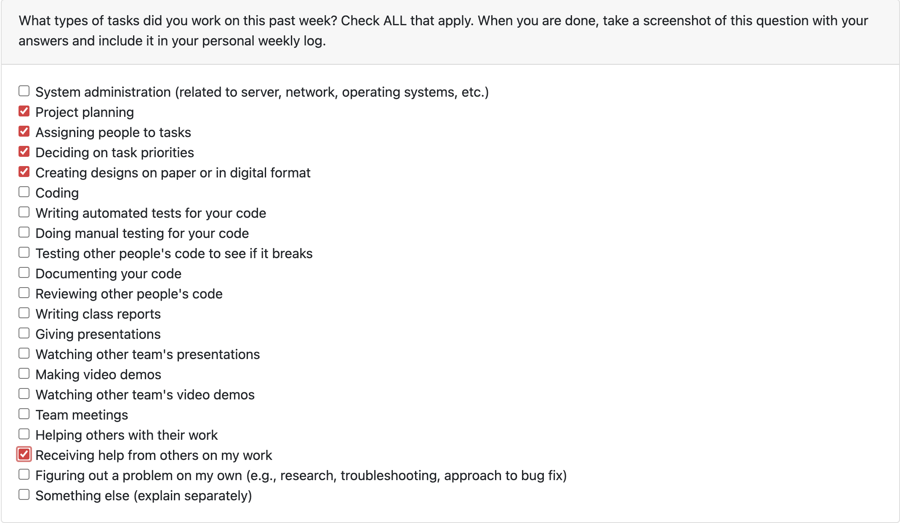

---

## Week 5

### October 2 - October 8, 2023

- This week I worked on the Create Request Figma design.
- The goals for this week were to begin work on the Figma designs for our webpages to be used in the mini-presentation.
- I worked on `Create Figma design for Create Request page #27`. 

### Picture of Project Board

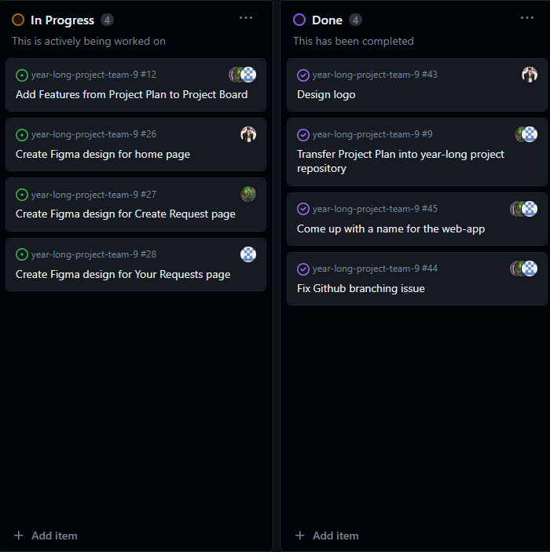

### Picture of Week 5's Survey

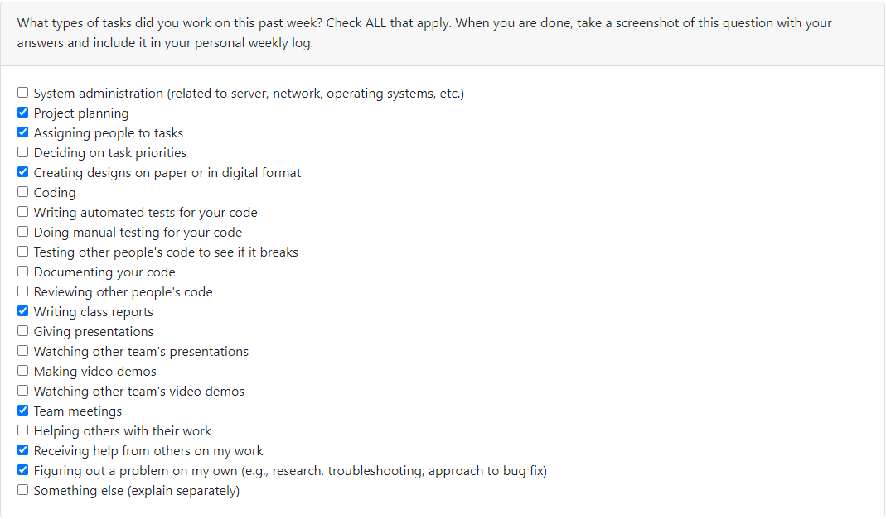

---

## Week 6

### October 9 - October 15, 2023

- This week I worked on the milestone to create a design for the web page to create a video request.
- The goals for this week were to finalise the Figma designs and set up our coding environments to begin working on the web app.

### Picture of Project Board

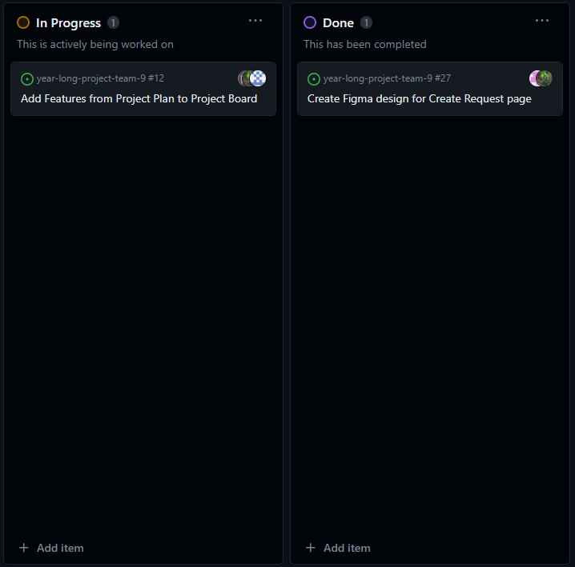

### Picture of Week 6's Survey

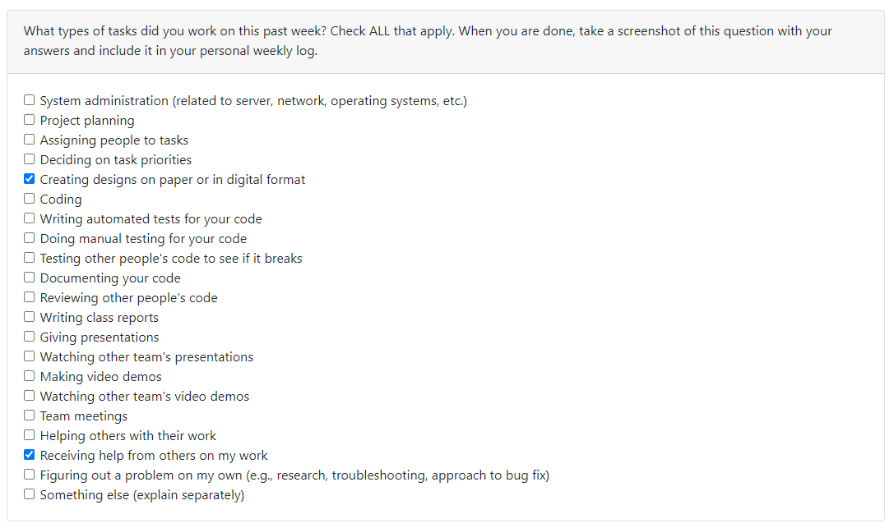

---

## Week 7

### October 16 - October 22, 2023

- This week I worked on the milestone to research how Next.js uses page routing for web apps.
- The goals for this week were to begin coding with Next.js and researching functionality for our web app.

### Picture of Project Board

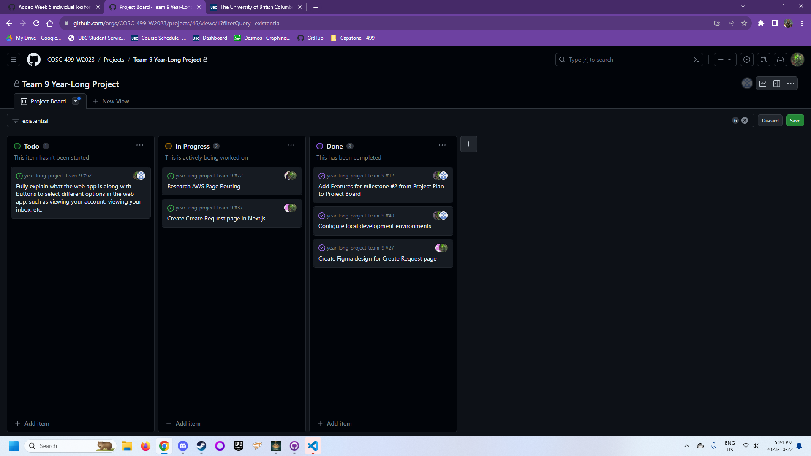

---

## Week 8

### October 23 - October 29, 2023

- This week I worked on Milestone #2, the Mini-Presentation.
- The goals for this week were to code the landing and Create Request webpages and begin to form our mini-presentation.

### Picture of Project Board

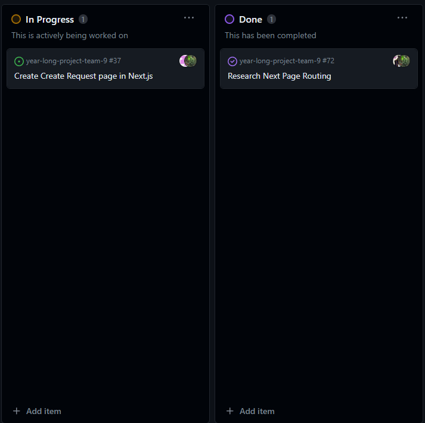

### Picture of Week 8's Survey

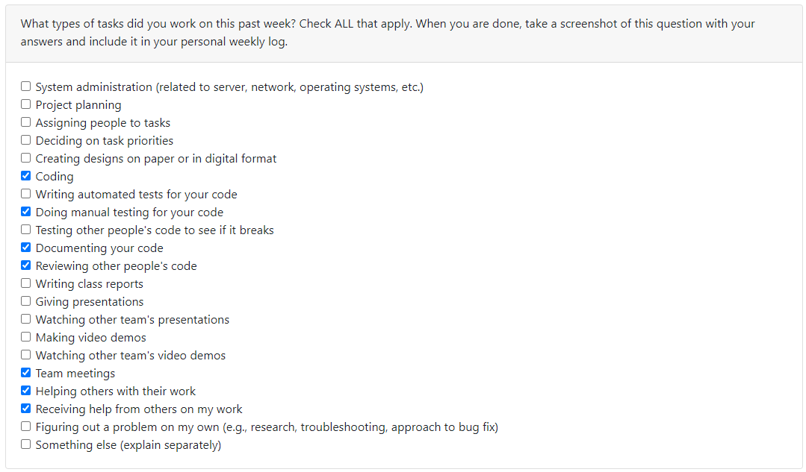

---

## Week 9

### October 30 - November 5, 2023

- This week I worked on Milestone #2, the Mini-Presentation.
- The goals for this week were to prepare for and perform our Mini-Presentation.

### Picture of Project Board

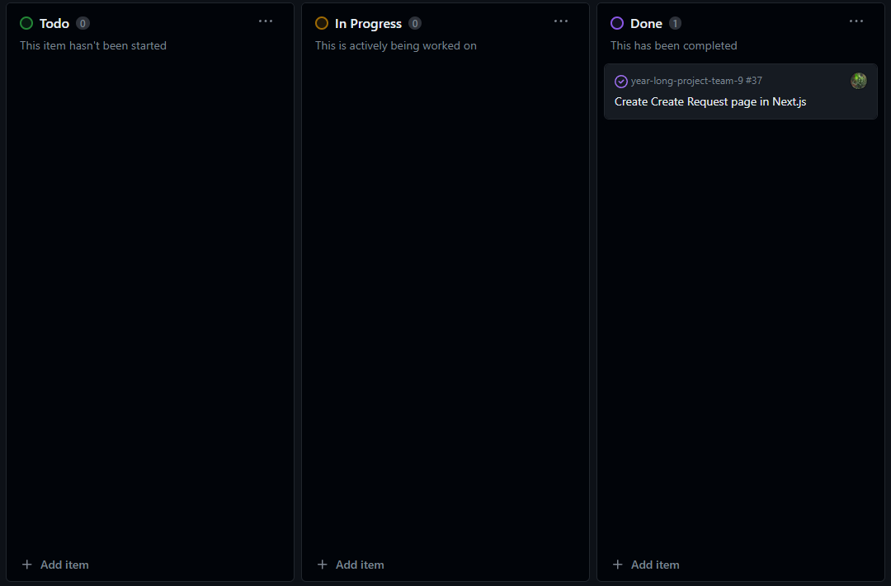

### Picture of Week 9's Survey

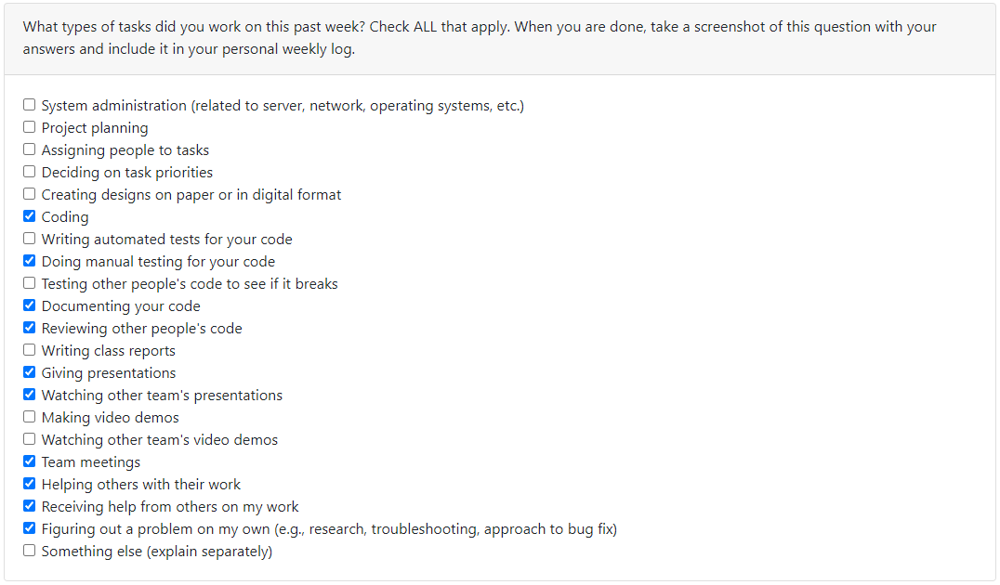