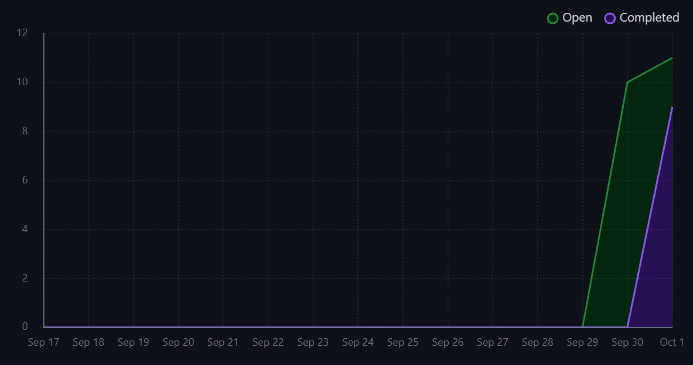
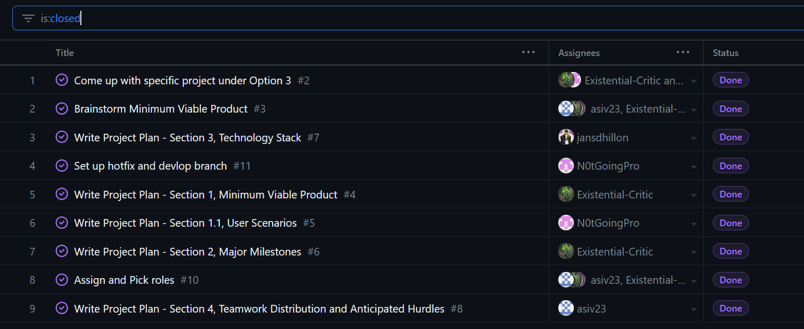
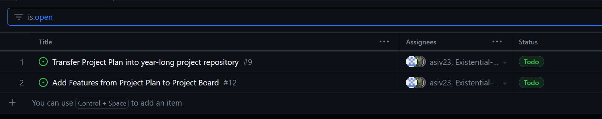

# TEAM 9 - WEEK 4

## Team Members

* Existential-Critic  -  Soren Stenback

* jansdhillon         -  Jan-Yaeger Dhillon

* asiv23              -  Baz Sivakua

* N0tGoingPro         -  Muhammad Bakar

## Work Period

Week 4 ran from 0000 on 2023/09/25 to 2359 on 2023/10/01.

## Milestone Goal Recap

### Milestone Goal 1: Complete Project Plan
Complete the project plan that outlines the project and what each group member is expected to do. Make sure that each member has a clear understanding of their repsonsibilities and the direction of the project. 

### Milestone Goal 2: Set Up GitHub
Set up the team GitHub and Project page. This includes making the relevant branches, team log files and adding tasks to the project board. This ensures the team has clear goals and will allow us to keep track of our progress and rate of activity. 

## Associated Board Tasks

The tasks identified for this week were:

### Task 1: Come up with specific project under Option 3

* **Status:** Complete
* **Assignee(s):** All Group Members
* **Associated Milestone Goal:** Milestone Goal 1: Complete Project Plan
* **Description:** Discuss a more specific goal for the project in preperation for the MVP.

### Task 2: Brainstorm Minimum Viable Product

* **Status:** Complete
* **Assignee(s):** All Group Members
* **Associated Milestone Goal:** Milestone Goal 1: Complete Project Plan
* **Description:** Engage in a group meeting and discuss the MVP for the project. Once the MVP was outlined, we understood which direction we wanted the project to take. This would help us come up with the requirements and features of the project.

### Task 3: Set up hotfix and devlop branch

* **Status:** Complete
* **Assignee(s):** Muhammad Bakar
* **Associated Milestone Goal:** Milestone Goal 2: Set Up GitHub
* **Description:** Create Hotfix and Development branches for the github.

### Task 4: Role and Task Assignment

* **Status:** Complete
* **Assignee(s):** All Group Members
* **Associated Milestone Goal:** Milestone Goal 1: Complete Project Plan
* **Description:** Create a list of features within the project and assign each member to different tasks which compliment their skillset. 

### Task 5: Write Project Plan - Section 1, Minimum Viable Product

* **Status:** Complete
* **Assignee(s):** Soren Stenback
* **Associated Milestone Goal:** Milestone Goal 1: Complete Project Plan
* **Description:** Document the MVP brainstormed in task 2 in full detail in the project plan. This ensures we have full details of the deliverable we are expected to have and build from it. 

### Task 6: Write Project Plan - Section 1.1, User Scenarios

* **Status:** Complete
* **Assignee(s):** Muhammad Bakar
* **Associated Milestone Goal:** Milestone Goal 1: Complete Project Plan
* **Description:** Document user scenarios for use of the web application once completed. This allows us an indept point of view of potential users and helps us envision the features we need. 

### Task 7: Write Project Plan - Section 2, Major Milestones

* **Status:** Complete
* **Assignee(s):** Soren Stenback
* **Associated Milestone Goal:** Milestone Goal 1: Complete Project Plan
* **Description:** Document major milestones within the project. This outlines what deliverables we should have at each stage of the project. 

### Task 8: Write Project Plan - Section 2, Major Milestones

* **Status:** Complete
* **Assignee(s):** Soren Stenback
* **Associated Milestone Goal:** Milestone Goal 1: Complete Project Plan
* **Description:** Document major milestones within the project. This outlines what deliverables we should have at each stage of the project. 

### Task 9: Write Project Plan - Section 2, Major Milestones

* **Status:** Complete
* **Assignee(s):** Soren Stenback
* **Associated Milestone Goal:** Milestone Goal 1: Complete Project Plan
* **Description:** Document major milestones within the project. This outlines what deliverables and provides clear deadlines we should have at each stage of the project. 

### Task 10: Write Project Plan - Section 3, Technology Stack

* **Status:** Complete
* **Assignee(s):** Jan-Yaeger Dhillon
* **Associated Milestone Goal:** Milestone Goal 1: Complete Project Plan
* **Description:** Research, select and document the technology stack for use in the project. This involves finding which of each kind of technology will be best suited for our purposes and weeding out undesirable software. 

### Task 11: Write Project Plan - Section 4, Teamwork Distribution and Anticipated Hurdles

* **Status:** Complete
* **Assignee(s):** Baz Sivakua
* **Associated Milestone Goal:** Milestone Goal 1: Complete Project Plan
* **Description:** Create framework to server group members' experience, expertise and areas of improvement. Develop features for divide the teah work and help decide on teamwork distribution based on this information. This allows the team to have a clear list of tasks to acomplish that suite their skills and help compensate for eachothers areas of improvement.  

### Task 12: Transfer Information to GitHub

* **Status:** In Progress
* **Assignee(s):** All Group Members
* **Associated Milestone Goal:** Milestone Goal 2: Set Up GitHub
* **Description:** Upload project plan document to project GitHub repository and transfer each task from the list created in section 4 to the project board. 

## Details

### Burnup Chart

### Table View of Completed Tasks

### Table View of In Progress Tasks

 