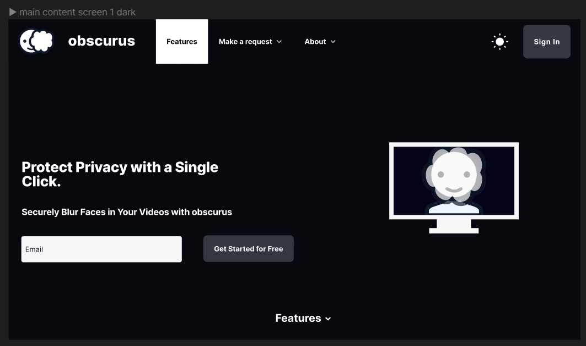
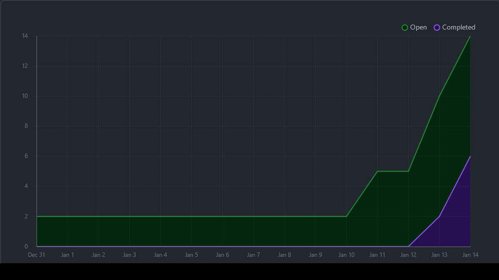

# TEAM 9 - WEEK 4

## Team Members

- Existential-Critic - Soren Stenback

- jansdhillon - Jan-Yaeger Dhillon

- asiv23 - Baz Sivakua

- N0tGoingPro - Muhammad Bakar

## Work Period

Week 4 ran from 0000 on 2023/09/25 to 2359 on 2023/10/01.

## Milestone Goal Recap

### Milestone Goal 1: Complete Project Plan

Complete the project plan that outlines the project and what each group member is expected to do. Make sure that each member has a clear understanding of their repsonsibilities and the direction of the project.

### Milestone Goal 2: Set Up GitHub

Set up the team GitHub and Project page. This includes making the relevant branches, team log files and adding tasks to the project board. This ensures the team has clear goals and will allow us to keep track of our progress and rate of activity.

## Associated Board Tasks

The tasks identified for this week were:

### Task 1: Come up with specific project under Option 3

- **Status:** Complete
- **Assignee(s):** All Group Members
- **Associated Milestone Goal:** Milestone Goal 1: Complete Project Plan
- **Description:** Discuss a more specific goal for the project in preperation for the MVP.

### Task 2: Brainstorm Minimum Viable Product

- **Status:** Complete
- **Assignee(s):** All Group Members
- **Associated Milestone Goal:** Milestone Goal 1: Complete Project Plan
- **Description:** Engage in a group meeting and discuss the MVP for the project. Once the MVP was outlined, we understood which direction we wanted the project to take. This would help us come up with the requirements and features of the project.

### Task 3: Set up hotfix and devlop branch

- **Status:** Complete
- **Assignee(s):** Muhammad Bakar
- **Associated Milestone Goal:** Milestone Goal 2: Set Up GitHub
- **Description:** Create Hotfix and Development branches for the github.

### Task 4: Role and Task Assignment

- **Status:** Complete
- **Assignee(s):** All Group Members
- **Associated Milestone Goal:** Milestone Goal 1: Complete Project Plan
- **Description:** Create a list of features within the project and assign each member to different tasks which compliment their skillset.

### Task 5: Write Project Plan - Section 1, Minimum Viable Product

- **Status:** Complete
- **Assignee(s):** Soren Stenback
- **Associated Milestone Goal:** Milestone Goal 1: Complete Project Plan
- **Description:** Document the MVP brainstormed in task 2 in full detail in the project plan. This ensures we have full details of the deliverable we are expected to have and build from it.

### Task 6: Write Project Plan - Section 1.1, User Scenarios

- **Status:** Complete
- **Assignee(s):** Muhammad Bakar
- **Associated Milestone Goal:** Milestone Goal 1: Complete Project Plan
- **Description:** Document user scenarios for use of the web application once completed. This allows us an indept point of view of potential users and helps us envision the features we need.

### Task 7: Write Project Plan - Section 2, Major Milestones

- **Status:** Complete
- **Assignee(s):** Soren Stenback
- **Associated Milestone Goal:** Milestone Goal 1: Complete Project Plan
- **Description:** Document major milestones within the project. This outlines what deliverables we should have at each stage of the project.

### Task 8: Write Project Plan - Section 2, Major Milestones

- **Status:** Complete
- **Assignee(s):** Soren Stenback
- **Associated Milestone Goal:** Milestone Goal 1: Complete Project Plan
- **Description:** Document major milestones within the project. This outlines what deliverables we should have at each stage of the project.

### Task 9: Write Project Plan - Section 2, Major Milestones

- **Status:** Complete
- **Assignee(s):** Soren Stenback
- **Associated Milestone Goal:** Milestone Goal 1: Complete Project Plan
- **Description:** Document major milestones within the project. This outlines what deliverables and provides clear deadlines we should have at each stage of the project.

### Task 10: Write Project Plan - Section 3, Technology Stack

- **Status:** Complete
- **Assignee(s):** Jan-Yaeger Dhillon
- **Associated Milestone Goal:** Milestone Goal 1: Complete Project Plan
- **Description:** Research, select and document the technology stack for use in the project. This involves finding which of each kind of technology will be best suited for our purposes and weeding out undesirable software.

### Task 11: Write Project Plan - Section 4, Teamwork Distribution and Anticipated Hurdles

- **Status:** Complete
- **Assignee(s):** Baz Sivakua
- **Associated Milestone Goal:** Milestone Goal 1: Complete Project Plan
- **Description:** Create framework to server group members' experience, expertise and areas of improvement. Develop features for divide the teah work and help decide on teamwork distribution based on this information. This allows the team to have a clear list of tasks to acomplish that suite their skills and help compensate for eachothers areas of improvement.

### Task 12: Transfer Information to GitHub

- **Status:** In Progress
- **Assignee(s):** All Group Members
- **Associated Milestone Goal:** Milestone Goal 2: Set Up GitHub
- **Description:** Upload project plan document to project GitHub repository and transfer each task from the list created in section 4 to the project board.

## Details

### Burnup Chart

### Table View of Completed Tasks

### Table View of In Progress Tasks

---

# TEAM 9 - WEEK 5

## Team Members

- Existential-Critic - Soren Stenback

- jansdhillon - Jan-Yaeger Dhillon

- asiv23 - Baz Sivakua

- N0tGoingPro - Muhammad Bakar

## Work Period

Week 5 ran from 00:00 on 2023/10/02 to 23:59 on 2023/10/08.

## Milestone Goal Recap

### Milestone Goal 1: Create designs in Figma

- Started Figma design. The milestone requires completing a logo, and completing four pages: `Your Requests page`, `single request page`, `home page`, and `Create Request Page`. Thus far, we have the design of the logo figured out, and have made much progress on the `home page`, `Your Request Page` and `Create Request Page`.

## Associated Board Tasks

The tasks identified for this week were:

### Task 1: Design logo

- **Status:** Complete
- **Assignee(s):** Jan-Yaeger Dhillon
- **Associated Milestone Goal:** Milestone Goal 1: Create designs in Figma
- **Description:** Design the logo for the web-app

### Task 2: Create Figma design for home page

- **Status:** In progress
- **Assignee(s):** Jan-Yaeger Dhillon
- **Associated Milestone Goal:** Milestone Goal 1: Create designs in Figma
- **Description:** In Figma create a design for the home-page for the web-app

### Task 3: Create Figma design for Create Request page

- **Status:** In progress
- **Assignee(s):** Soren Stenback
- **Associated Milestone Goal:** Milestone Goal 1: Create designs in Figma
- **Description:** In Figma create the design for the create request page (a page used by user's to request videos)

### Task 4: Fix Github branching issue

- **Status:** Complete
- **Assignee(s):** All members
- **Associated Milestone Goal:** N/A
- **Description:** During week 4, some group members did not use the branches correctly, thereby requiring a fix

### Task 5: Come up with a name for the web-app

- **Status:** Complete
- **Assignee(s):** All members
- **Associated Milestone Goal:** Milestone Goal 1: Create designs in Figma
- **Description:** Come up with a name for the web-app

### Task 6: Transfer Project Plan into year-long project repository

- **Status:** Complete
- **Assignee(s):** Soren Stenback and Baz Sivakua
- **Associated Milestone Goal:** N/A
- **Description:** Upload the project plan to the Github repository

### Task 7: Create Figma design for Your Requests page

- **Status:** In progress
- **Assignee(s):** Baz Sivakua
- **Associated Milestone Goal:** Milestone Goal 1: Create designs in Figma
- **Description:** In Figma design a page where users can see their requests

## Details

### Burnup Chart

### Table View of Completed Tasks

### Table View of In Progress Tasks

---

# TEAM 9 - WEEK 6 & 7

## Team Members

- Existential-Critic - Soren Stenback

- jansdhillon - Jan-Yaeger Dhillon

- asiv23 - Baz Sivakua

- N0tGoingPro - Muhammad Bakar

## Work Period

Week 6 & 7 ran from 00:00 on 2023/10/09 to 23:59 on 2023/10/22.

## Milestone Goal Recap

### Milestone Goal 1: Create designs in Figma

- Completed the Figma designs for the pages outlined in the previous log (`Your Requests page`, `single request page`, `home page`, and `Create Request Page`).

### Milestone Goal 2: Configure enviorment for coding

- Configure APIs planned to use in this stage of development including AWS Amplify, Tailwind and Next.js. Additionally, those of us who are unfamilar with the APIs have done research to understand ways to code using them. Set up local enviroment to start coding.

### Milestone Goal 3: Front-End Coding

- Start to code the web pages for each of the completed figma designs: `Your Requests page`, `single request page`, `home page`, and `Create Request Page`, with the APIs listed above.

## Associated Board Tasks

The tasks identified for this week were:

### Task 1: Create Figma design for home page

- **Status:** Completed
- **Assignee(s):** Jan-Yaeger Dhillon
- **Associated Milestone Goal:** Milestone Goal 1: Create designs in Figma
- **Description:** In Figma create a design for the home-page for the web-app with alternate dark mode color scheme.

### Task 2: Create Figma design for Create Request page

- **Status:** Complete
- **Assignee(s):** Soren Stenback and Muhammad Bakar
- **Associated Milestone Goal:** Milestone Goal 1: Create designs in Figma
- **Description:** In Figma create the design for the create request page (a page used by user's to request videos)

### Task 3: Create Figma design for Your Requests page

- **Status:** Complete
- **Assignee(s):** Baz Sivakua and Muhammad Bakar
- **Associated Milestone Goal:** Milestone Goal 1: Create designs in Figma
- **Description:** In Figma design a page where users can see their requests

### Task 4: Create Figma design for a single request page

- **Status:** Complete
- **Assignee(s):** Jan-Yaeger Dhillon and Muhammad Bakar
- **Associated Milestone Goal:** Milestone Goal 1: Create designs in Figma
- **Description:** In Figma design a page where users can submit their videos for processing

### Task 5: Configure Tailwind CSS for the project

- **Status:** Complete
- **Assignee(s):** Jan-Yaeger Dhillon
- **Associated Milestone Goal:** Milestone Goal 2: Configure enviorment for coding
- **Description:** Configure Tailwind CSS for front end coding

### Task 6: Set up Next.js for the project

- **Status:** Complete
- **Assignee(s):** Jan-Yaeger Dhillon
- **Associated Milestone Goal:** Milestone Goal 2: Configure enviorment for coding
- **Description:** Configure Next.js for front end coding

### Task 7: Set up Jest for the project

- **Status:** Complete
- **Assignee(s):** Jan-Yaeger Dhillon and Muhammad Bakar
- **Associated Milestone Goal:** Milestone Goal 2: Configure enviorment for coding
- **Description:** Configure Jest for front end coding

### Task 8: Configure local development environments

- **Status:** Complete
- **Assignee(s):** All Members
- **Associated Milestone Goal:** Milestone Goal 2: Configure enviorment for coding
- **Description:** Configure local enviorments with all APIs for all member's personal devices

### Task 9: Research AWS Step Functions

- **Status:** Complete
- **Assignee(s):** Jan-Yaeger Dhillon and Muhammad Bakar
- **Associated Milestone Goal:** Milestone Goal 2: Configure enviorment for coding
- **Description:** Research use of AWS step functions and how to best use it for our project

### Task 10: Set up AWS CodePipeline

- **Status:** In Progress
- **Assignee(s):** Jan-Yaeger Dhillon and Muhammad Bakar
- **Associated Milestone Goal:** Milestone Goal 2: Configure enviorment for coding
- **Description:** Based on the research done in Task 8, configure AWS CodePipeline for use in the project

### Task 12: Set up AWS Amplify for the project

- **Status:** In Progress
- **Assignee(s):** Jan-Yaeger Dhillon
- **Associated Milestone Goal:** Milestone Goal 2: Configure enviorment for coding
- **Description:** Set up AWS Amplify for use in the project

### Task 13: Create home page in Next.js

- **Status:** In Progress
- **Assignee(s):** Jan-Yaeger Dhillon
- **Associated Milestone Goal:** Milestone Goal 3: Front-End Coding
- **Description:** Start coding page designed in task 1

### Task 14: Create Your Requests page in Next.js

- **Status:** In Progress
- **Assignee(s):** Baz Sivakua
- **Associated Milestone Goal:** Milestone Goal 3: Front-End Coding
- **Description:** Start coding page designed in task 3

### Task 15: Create home page in Next.js

- **Status:** In Progress
- **Assignee(s):** Jan-Yaeger Dhillon and Soren Stenback
- **Associated Milestone Goal:** Milestone Goal 3: Front-End Coding
- **Description:** Start coding page designed in task 2

### Task 16: Research AWS Page Routing

- **Status:** In Progress
- **Assignee(s):** Soren Stenback and Muhammad Bakar
- **Associated Milestone Goal:** Milestone Goal 2: Configure enviorment for coding
- **Description:** Research the use of the AWS Page Routing plug in

## Details

### Burnup Chart

### Table View of Completed Tasks

### Table View of In Progress Tasks

---

# TEAM 9 - WEEK 8

## Team Members

- Existential-Critic - Soren Stenback

- jansdhillon - Jan-Yaeger Dhillon

- asiv23 - Baz Sivakua

- N0tGoingPro - Muhammad Bakar

## Work Period

Week 8 ran from 00:00 on 2023/10/23 to 23:59 on 2023/10/29.

## Milestone Goal Recap

### Milestone Goal 1: Configure enviorment for coding

- Configure APIs planned to use in this stage of development including AWS Amplify, Tailwind and Next.js. Additionally, those of us who are unfamilar with the APIs have done research to understand ways to code using them. Set up local enviroment to start coding.

### Milestone Goal 2: Front-End Coding

- Complete coding for pages `single request page` and `home page`.

### Milestone Goal 3: Prepare Presentation

- Prepare pages and documentation for the mini-presentation. Ensure that we can describe everything clearly and within the time constraints.

## Associated Board Tasks

The tasks identified for this week were:

### Task 1: Make AWS Step Function Plan

- **Status:** Completed
- **Assignee(s):** Muhammad Bakar and Jan-Yaeger Dhillon
- **Associated Milestone Goal:** Milestone Goal 1: Configure enviorment for coding
- **Description:** Define a workflow for the project created through AWS services. This will help us plan to coordinate and automate multiple AWS services in the future.

### Task 2: Create AWS Step Functions Diagram

- **Status:** Completed
- **Assignee(s):** Muhammad Bakar and Jan-Yaeger Dhillon
- **Associated Milestone Goal:** Milestone Goal 1: Configure enviorment for coding
- **Description:** Create a visual workflow diagram using the plan created in the previous task. A visual workflow diagram clearly defines how we intend to carry on with the project.

### Task 3: Set up AWS CodePipeline

- **Status:** In Progress
- **Assignee(s):** Jan-Yaeger Dhillon
- **Associated Milestone Goal:** Milestone Goal 1: Configure enviorment for coding
- **Description:** Set up AWS CodePipeline for use in the project

### Task 4: Set up AWS Amplify for the project

- **Status:** Completed
- **Assignee(s):** Jan-Yaeger Dhillon
- **Associated Milestone Goal:** Milestone Goal 1: Configure enviorment for coding
- **Description:** Set up AWS Amplify for use in the project

### Task 5: Create Single Requests page in Next.js

- **Status:** In Progress
- **Assignee(s):** Soren Stenback and Muhammad Bakar
- **Associated Milestone Goal:** Milestone Goal 2: Front-End Coding
- **Description:** Start coding the page allowing for users to create a request

### Task 6: Create Home page in Next.js

- **Status:** Completed
- **Assignee(s):** Jan-Yaeger Dhillon
- **Associated Milestone Goal:** Milestone Goal 2: Front-End Coding
- **Description:** Start coding home/landing page for the web application.

### Task 7: Fully explain what the web app is along with buttons to select different options in the web app, such as viewing your account, viewing your inbox, etc.

- **Status:** In Progress
- **Assignee(s):** Baz Sivakua
- **Associated Milestone Goal:** Milestone Goal 2: Front-End Coding and Milestone Goal 3: Prepare Presentation
- **Description:** Write the text for the about section of the web application. Alongside working on the introduction of our project in the mini-presentation.

### Task 8: Research Next Page Routing

- **Status:** Completed
- **Assignee(s):** Jan-Yaeger Dhillon and Soren Stenback
- **Associated Milestone Goal:** Milestone Goal 1: Configure enviorment for coding
- **Description:** Research use of Next Page Routing and how to best use it for our project

## Details

### Burnup Chart

### Table View of Completed Tasks

### Table View of In Progress Tasks

---

# TEAM 9 - WEEK 9

## Work Period

Week 9 ran from 00:00 on 2023/10/30 to 23:59 on 2023/11/05.

## Milestone Goal Recap

### Milestone Goal 1: Configure enviorment for coding

- Configure APIs planned to use in this stage of development including AWS Amplify, Tailwind and Next.js. Additionally, those of us who are unfamilar with the APIs have done research to understand ways to code using them. Set up local enviroment to start coding.

### Milestone Goal 2: Front-End Coding

- Complete coding for pages `single request page` and `home page`.

### Milestone Goal 3: Mini-Presentation

- Prepare pages and documentation for the mini-presentation. Ensure that we can describe everything clearly and within the time constraints. Deliver the presentation and give feedback to other teams.

## Associated Board Tasks

The tasks identified for this week were:

### Task 1: Plan for AWS CodePipeline

- **Status:** Completed
- **Assignee(s):** Muhammad Bakar and Jan-Yaeger Dhillon
- **Associated Milestone Goal:** Milestone Goal 1: Configure enviorment for coding
- **Description:** Plan how to best implement AWS Codepipeline for our project

### Task 2: Plan for AWS CodeBuild

- **Status:** Completed
- **Assignee(s):** Muhammad Bakar and Jan-Yaeger Dhillon
- **Associated Milestone Goal:** Milestone Goal 1: Configure enviorment for coding
- **Description:** Plan how to best implement AWS CodeBuild for our project

### Task 3: Create Single Requests page in Next.js

- **Status:** Completed
- **Assignee(s):** Soren Stenback and Muhammad Bakar
- **Associated Milestone Goal:** Milestone Goal 2: Front-End Coding
- **Description:** Finish coding the page allowing for users to create a request

### Task 4: Fully explain what the web app is along with buttons to select different options in the web app, such as viewing your account, viewing your inbox, etc.

- **Status:** Completed
- **Assignee(s):** Baz Sivakua
- **Associated Milestone Goal:** Milestone Goal 2: Front-End Coding and Milestone Goal 3: Mini-Presentation
- **Description:** Complete documentaion for web interface. Write the text for the about section of the web application. Alongside working on the introduction of our project in the mini-presentation.

### Task 5: Prepare for Mini-Presentaion

- **Status:** Completed
- **Assignee(s):** All Team Members
- **Associated Milestone Goal:** Milestone Goal 3: Mini-Presentation
- **Description:** Create slides, scripts, etc and practice giving the presentation to ensure we remain within the 5 min time limit.

### Task 6: Give Mini-Presentaion

- **Status:** Completed
- **Assignee(s):** All Team Members
- **Associated Milestone Goal:** Milestone Goal 3: Mini-Presentation
- **Description:** Present what our team has worked on for this milestone for the class. Give reviews to other teams.

## Details

### Burnup Chart

### Table View of Completed Tasks

All tasks for `Milestone 2 - minipresentation` were completed

---

# TEAM 9 - WEEK 10

## Work Period

Week 9 ran from 00:00 on 2023/11/06 to 23:59 on 2023/11/12.

## Milestone Goal Recap

### Milestone Goal 1: Milestone 3 Project Planning

Ensure all members of the team have a clear understanding of what is required for Milestone 3: Design Submission and which tasks they'll be assigned.

### Milestone Goal 2: Configure enviorment for coding

Configure APIs planned to use in this stage of development including AWS Amplify, Tailwind and Next.js. Additionally, those of us who are unfamilar with the APIs have done research to understand ways to code using them. Set up local enviroment to start coding.

### Milestone Goal 3: Front-End Coding

Complete coding for the different website pages, such as the `Request Listings Page` and `Submission Page`

## Associated Board Tasks

The tasks identified for this week were:

### Task 1: Import Milestone #3 tasks from Project Plan

- **Status:** Completed
- **Assignee(s):** Baz Sivakua
- **Associated Milestone Goal:** Milestone Goal 1: Milestone 3 Project Planning
- **Description:** Import Milestone goals from project plan

### Task 2: Complete General User Interface Design

- **Status:** Completed
- **Assignee(s):** All Team Members
- **Associated Milestone Goal:** Milestone Goal 1: Milestone 3 Project Planning
- **Description:** Complete general user interface design with standardised colours, fonts, and layouts, so that future pages will look coherent and consistent with existing pages.

### Task 3: Implement end-to-end testing and Jest

- **Status:** Completed
- **Assignee(s):** Jan-Yaeger Dhillon
- **Associated Milestone Goal:** Milestone Goal 2: Configure enviorment for coding
- **Description:** Implement end-to-end testing through Playwright and unit tests through Jest

### Task 4: Init lambda/sst

- **Status:** Completed
- **Assignee(s):** Jan-Yaeger Dhillon
- **Associated Milestone Goal:** Milestone Goal 2: Configure enviorment for coding
- **Description:** Initialize AWS Lambda/sst for use in our project

### Task 5: Fix errors in Create Request Page

- **Status:** Inprogress
- **Assignee(s):** Soren Stenback and Muhammad Bakar
- **Associated Milestone Goal:** Milestone Goal 3: Front-End Coding
- **Description:** Fix errors in `Create Request Page` encountered during the mini-presentation with scaling the cards on different size screens.

### Task 6: Init api gateway

- **Status:** Inprogress
- **Assignee(s):** Jan-Yaeger Dhillon
- **Associated Milestone Goal:** Milestone Goal 2: Configure enviorment for coding
- **Description:** Initialize API gateway for use in our project

### Task 7: Complete Submission Page

- **Status:** Inprogress
- **Assignee(s):** Jan-Yaeger Dhillon
- **Associated Milestone Goal:** Milestone Goal 3: Front-End Coding
- **Description:** Create `Submission Page` which will allow the user to submit a video and process it in response to a request

### Task 8: Make Homepage Responsive

- **Status:** Inprogress
- **Assignee(s):** Jan-Yaeger Dhillon
- **Associated Milestone Goal:** Milestone Goal 3: Front-End Coding
- **Description:** Edit `Home Page` to be responsive to screen size and allow for good formatting across different screen sizes

### Task 9: Migrate from Pages Router to App Router

- **Status:** Inprogress
- **Assignee(s):** Jan-Yaeger Dhillon and Baz Sivakua
- **Associated Milestone Goal:** Milestone Goal 3: Front-End Coding
- **Description:** Migrate from page router to app router in nextjs

### Task 10: Create Request Listings Page

- **Status:** Inprogress
- **Assignee(s):** Baz Sivakua
- **Associated Milestone Goal:** Milestone Goal 3: Front-End Coding
- **Description:** Create `Request Listings Page` which will display the requests a user has made or needs to submit a video for.

## Details

### Burnup Chart

### Table View of Completed Tasks

### Table View of In Progress Tasks

---

# TEAM 9 - WEEK 11 & 12

## Work Period

Week 11 & 12 ran from 00:00 on 2023/11/13 to 23:59 on 2023/11/26.

## Milestone Goal Recap

### Milestone Goal 1: Configure enviorment for coding

Configure APIs planned to use in this stage of development including AWS Amplify, Tailwind and Next.js. Additionally, those of us who are unfamilar with the APIs have done research to understand ways to code using them. Set up local enviroment to start coding.

### Milestone Goal 2: Front-End Coding

Complete coding for the different website pages, such as the `Request Listings Page` and `Submission Page`

### Milestone Goal 3: Back-End Coding

Complete coding for back-end functionality of the application, such as the system architecture and database.

## Associated Board Tasks

The tasks identified for this week were:

### Task 1: Fix errors in Create Request Page

- **Status:** Completed
- **Assignee(s):** Soren Stenback and Muhammad Bakar
- **Associated Milestone Goal:** Milestone Goal 2: Front-End Coding
- **Description:** Fix errors in `Create Request Page` encountered during the mini-presentation with scaling the cards on different size screens.

### Task 2: Set up user authentication

- **Status:** Completed
- **Assignee(s):** Muhammad Bakar
- **Associated Milestone Goal:** Milestone Goal 1: Configure enviorment for coding
- **Description:** Research and set up Cognito for user authentication on our web application

### Task 3: Link Cognito to application

- **Status:** Completed
- **Assignee(s):** Muhammad Bakar
- **Associated Milestone Goal:** Milestone Goal 3: Back-End Coding
- **Description:** Link cognito user authentication services to our web application

### Task 4: Init api gateway

- **Status:** In progress
- **Assignee(s):** Jan-Yaeger Dhillon
- **Associated Milestone Goal:** Milestone Goal 1: Configure enviorment for coding
- **Description:** Initialize API gateway for use in our project

### Task 5: Complete Submission Page

- **Status:** In progress
- **Assignee(s):** Jan-Yaeger Dhillon
- **Associated Milestone Goal:** Milestone Goal 2: Front-End Coding
- **Description:** Create `Submission Page` which will allow the user to submit a video and process it in response to a request

### Task 6: Make Homepage Responsive

- **Status:** In progress
- **Assignee(s):** Jan-Yaeger Dhillon
- **Associated Milestone Goal:** Milestone Goal 2: Front-End Coding
- **Description:** Edit `Home Page` to be responsive to screen size and allow for good formatting across different screen sizes

### Task 7: Migrate from Pages Router to App Router

- **Status:** In progress
- **Assignee(s):** Jan-Yaeger Dhillon and Baz Sivakua
- **Associated Milestone Goal:** Milestone Goal 2: Front-End Coding
- **Description:** Migrate from page router to app router in nextjs

### Task 8: Create Request Listings Page

- **Status:** In progress
- **Assignee(s):** Baz Sivakua
- **Associated Milestone Goal:** Milestone Goal 2: Front-End Coding
- **Description:** Create `Request Listings Page` which will display the requests a user has made or needs to submit a video for.

### Task 9: Create System Architecture Design

- **Status:** In progress
- **Assignee(s):** All team members
- **Associated Milestone Goal:** Milestone Goal 3: Back-End Coding
- **Description:** Discuss and complete a system architecture design for the back end of our project. Ensure everyone has a clear understanding of how each tool links together.

## Details

### Burnup Chart

### Table View of Completed Tasks

### Table View of In Progress Tasks

### Test Report

---

# TEAM 9 - WEEK 13

## Work Period

Week 13 ran from 00:00 on 2023/11/27 to 23:59 on 2023/12/03.

## Milestone Goal Recap

### Milestone Goal 1: Configure enviorment for coding

Configure APIs planned to use in this stage of development including AWS Amplify, Tailwind and Next.js. Additionally, those of us who are unfamilar with the APIs have done research to understand ways to code using them. Set up local enviroment to start coding.

### Milestone Goal 2: Front-End Coding

Complete coding for the different website pages, such as the `Request Listings Page` and `Submission Page`

### Milestone Goal 3: Back-End Coding

Complete coding for back-end functionality of the application, such as the system architecture and database.

## Associated Board Tasks

The tasks identified for this week were:

### Task 1: Create System Architecture Design

- **Status:** Completed
- **Assignee(s):** All team members
- **Associated Milestone Goal:** Milestone Goal 3: Back-End Coding
- **Description:** Discuss and complete a system architecture design for the back end of our project. Ensure everyone has a clear understanding of how each tool links together.

### Task 2: Fix Playwright Workflow

- **Status:** Completed
- **Assignee(s):** Jan-Yaeger Dhillon
- **Associated Milestone Goal:** Milestone Goal 3: Back-End Coding
- **Description:** Fix issue with playwright workflow running repeatedly

### Task 3: Database Design

- **Status:** Completed
- **Assignee(s):** Muhammad Bakar
- **Associated Milestone Goal:** Milestone Goal 3: Back-End Coding
- **Description:** Design database for storage of information such as videos and requests.

### Task 4: Add Tables to Database

- **Status:** Completed
- **Assignee(s):** Muhammad Bakar
- **Associated Milestone Goal:** Milestone Goal 3: Back-End Coding
- **Description:** Add tables to the database to use in storage of information for the web application.

### Task 5: Create Request Listings Page

- **Status:** Completed
- **Assignee(s):** Baz Sivakua
- **Associated Milestone Goal:** Milestone Goal 2: Front-End Coding
- **Description:** Create `Request Listings Page` which will display the requests a user has made or needs to submit a video for.

### Task 6: Update Documentation

- **Status:** Completed
- **Assignee(s):** Baz Sivakua
- **Associated Milestone Goal:** Milestone Goal 2: Front-End Coding
- **Description:** Complete documentation on all working components of the web

### Task 7: Complete Submission Page

- **Status:** Completed
- **Assignee(s):** Jan-Yaeger Dhillon
- **Associated Milestone Goal:** Milestone Goal 2: Front-End Coding
- **Description:** Create `Submission Page` which will allow the user to submit a video and process it in response to a request

### Task 8: Create Sign-in Page

- **Status:** Completed
- **Assignee(s):** Jan-Yaeger Dhillon and Soren Stenback
- **Associated Milestone Goal:** Milestone Goal 2: Front-End Coding
- **Description:** Complete a working registration page where users (both professional and client) are able to social sign in with Google, Facebook and Microsoft

### Task 9: Playwright Testing

- **Status:** Completed
- **Assignee(s):** Baz Sivakua
- **Associated Milestone Goal:** Milestone Goal 3: Back-End Coding
- **Description:** Research and implement improvements for playwright testing and create additional tests

## Details

### Burnup Chart

### Table View of Completed Tasks

All tasks for `Milestone 3 - Design Documentation` were completed

### Test Report

# TEAM 9 - TERM 2 WEEK 1

## Work Period

Week 1 ran from 00:00 on 2024/01/08 to 23:59 on 2024/01/14.

## Milestone Goal Recap

### Milestone Goal 1: Back-End Coding

Complete coding for back-end functionality of the application, such as the system architecture and database.

## Associated Board Tasks

The tasks identified for this week were:

### Task 1: Term 2 Project Plan

- **Status:** Completed
- **Assignee(s):** All team members
- **Associated Milestone Goal:** Milestone Goal 1: Back-End Coding
- **Description:** Ensure that everyone was on the same page regarding the work for term 2 and assign tasks. Add any relevant tasks to the Github project board

### Task 2: Set up login with Cognito

- **Status:** Completed
- **Assignee(s):** Muhammad Bakar
- **Associated Milestone Goal:** Milestone Goal 1: Back-End Coding
- **Description:** Set up email and password login for the appliction through Cognito

### Task 3: Initialize Seed Service

- **Status:** Completed
- **Assignee(s):** Jan-Yaeger Dhillon
- **Associated Milestone Goal:** Milestone Goal 1: Back-End Coding
- **Description:** Set up Seed serverless framework on AWS

### Task 4: Set up Cognito hosted UI

- **Status:** Completed
- **Assignee(s):** Muhammad Bakar
- **Associated Milestone Goal:** Milestone Goal 1: Back-End Coding
- **Description:** Add Logo and CSS to Cognito-hosted UI

### Task 5: Fix Playwrite

- **Status:** In-Progress
- **Assignee(s):** Baz Sivakua
- **Associated Milestone Goal:** Milestone Goal 1: Back-End Coding
- **Description:** Fix issues with Playwrite automatic testing

### Task 6: Set up Authentication

- **Status:** In-Progress
- **Assignee(s):** Muhammad Bakar
- **Associated Milestone Goal:** Milestone Goal 1: Back-End Coding
- **Description:** Add authentication via Cognito to app

### Task 7: Initialize SST for PostgreSQL

- **Status:** Completed
- **Assignee(s):** Soren Stenback
- **Associated Milestone Goal:** Milestone Goal 1: Back-End Coding
- **Description:** Initialize STT for PostgreSQL for use in backend database storage

### Task 8: Convert ER Diagram to PostgreSQL Table

- **Status:** Completed
- **Assignee(s):** Soren Stenback
- **Associated Milestone Goal:** Milestone Goal 1: Back-End Coding
- **Description:** Convert ER Diagram from previous milestone to PostgreSQL Table

### Task 9: Initialize api and link to service

- **Status:** Completed
- **Assignee(s):** Jan-Yaeger Dhillon
- **Associated Milestone Goal:** Milestone Goal 1: Back-End Coding
- **Description:** Initialize api and link to service

### Task 10: Add ability to send video to service

- **Status:** Completed
- **Assignee(s):** Jan-Yaeger Dhillon
- **Associated Milestone Goal:** Milestone Goal 1: Back-End Coding
- **Description:** Add ability to send video to service

### Task 11: Initialize lambda functions for video processing

- **Status:** Completed
- **Assignee(s):** Jan-Yaeger Dhillon
- **Associated Milestone Goal:** Milestone Goal 1: Back-End Coding
- **Description:** Initialize lambda functions for video processing

## Details

### Burnup Chart

### Table View of Completed Tasks

### Table View of In Progress Tasks

### Test Report

___

# TEAM 9 - TERM 2 WEEK 2

## Work Period

Week 2 ran from 00:00 on 2024/01/15 to 23:59 on 2024/01/21.

## Milestone Goal Recap

### Milestone Goal 1: Back-End Coding
Complete coding for back-end functionality of the application, such as the system architecture and database.

### Milestone Goal 2: Front-End Coding
Complete coding for front-pages and connect them to functions set up in back end development

## Associated Board Tasks

The tasks identified for this week were:

### Task 1: Initialize Example Rekognition

* **Status:** Completed
* **Assignee(s):** Jan-Yaeger Dhillon
* **Associated Milestone Goal:** Milestone Goal 1: Back-End Coding
* **Description:** Translate example rekognition to work with sst framework

### Task 2: Delete Old Branches

* **Status:** Completed
* **Assignee(s):** Jan-Yaeger Dhillon and Muhammad Bakar
* **Associated Milestone Goal:** N/a
* **Description:** Delete old GitHub branches from repository 

### Task 3: Migration

* **Status:** Completed
* **Assignee(s):** Muhammad Bakar and Soren Stenback
* **Associated Milestone Goal:** Milestone Goal 1: Back-End Coding
* **Description:** Migrate RSD scripts for database

### Task 4: Fix Playwrite

* **Status:** Completed
* **Assignee(s):** Baz Sivakua
* **Associated Milestone Goal:** Milestone Goal 1: Back-End Coding
* **Description:** Fix issues with Playwrite automatic testing allowing the server to be started and tests to be run with one command.

### Task 6: signOutBackEnd()

* **Status:** Complete
* **Assignee(s):** Muhammad Bakar and Soren Stenback
* **Associated Milestone Goal:** Milestone Goal 1: Back-End Coding
* **Description:** Complete function to allow signing out of backend

### Task 7: getEmail()

* **Status:** Complete
* **Assignee(s):** Muhammad Bakar and Soren Stenback
* **Associated Milestone Goal:** Milestone Goal 1: Back-End Coding
* **Description:** Complete function to retrieve email adresses from the database

### Task 8: getSub()

* **Status:** Complete
* **Assignee(s):** Muhammad Bakar and Soren Stenback
* **Associated Milestone Goal:** Milestone Goal 1: Back-End Coding
* **Description:** Complete function to retrieve submissions from the database

### Task 7: isAuthenticated()

* **Status:** Complete
* **Assignee(s):** Muhammad Bakar and Soren Stenback
* **Associated Milestone Goal:** Milestone Goal 1: Back-End Coding
* **Description:** Complete function to check if authenticated

### Task 7: getSub()

* **Status:** Complete
* **Assignee(s):** Muhammad Bakar and Soren Stenback
* **Associated Milestone Goal:** Milestone Goal 1: Back-End Coding
* **Description:** Complete function to retrieve submissions

### Task 8: Add Signup Page

* **Status:** Complete
* **Assignee(s):** Muhammad Bakar and Soren Stenback
* **Associated Milestone Goal:** Milestone Goal 1: Back-End Coding
* **Description:** Add Signup Page

### Task 8: Set up Authentication

* **Status:** In-Progress
* **Assignee(s):** Muhammad Bakar
* **Associated Milestone Goal:** Milestone Goal 1: Back-End Coding
* **Description:** Add authentication with Cognito to app via SST

### Task 9: Link function to Service

* **Status:** In-Progress
* **Assignee(s):** Jan-Yaeger Dhillon
* **Associated Milestone Goal:** Milestone Goal 1: Back-End Coding
* **Description:** Create containerized service that can access buckets/functions 

### Task 9: Create API Route 

* **Status:** Complete
* **Assignee(s):** Jan-Yaeger Dhillon
* **Associated Milestone Goal:** Milestone Goal 1: Back-End Coding
* **Description:** Create API route to communicated with Next.js 

### Task 10: Create Messages Page 

* **Status:** In-Progress
* **Assignee(s):** Baz Sivakua
* **Associated Milestone Goal:** Milestone Goal 2: Front-End Coding
* **Description:** Create pages for user to access messages

### Task 10: Fix Layout Issues 

* **Status:** In-Progress
* **Assignee(s):** Baz Sivakua
* **Associated Milestone Goal:** Milestone Goal 2: Front-End Coding
* **Description:** Fix layout issues with pages from previous milestones

## Details

### Burnup Chart

### Table View of Completed Tasks

### Table View of In Progress Tasks

### Test Report

End to end testing

___

# TEAM 9 - TERM 2 WEEK 2

## Work Period

Week 3 ran from 00:00 on 2024/01/22 to 23:59 on 2024/01/28.

## Milestone Goal Recap

### Milestone Goal 1: Back-End Coding
Complete coding for back-end functionality of the application, such as the system architecture and database.

### Milestone Goal 2: Front-End Coding
Complete coding for front-pages and connect them to functions set up in back end development

## Associated Board Tasks

The tasks identified for this week were:

### Task 1: Link function to Service

* **Status:** Completed
* **Assignee(s):** Jan-Yaeger Dhillon
* **Associated Milestone Goal:** Milestone Goal 1: Back-End Coding
* **Description:** Create containerized service that can access buckets/functions 

### Task 2: Migrate from Pages Router to App Router

- **Status:** Completed
- **Assignee(s):** Jan-Yaeger Dhillon
- **Associated Milestone Goal:** Milestone Goal 2: Front-End Coding
- **Description:** Migrate from page router to app router in nextjs

### Task 3: Create API Route

- **Status:** Completed
- **Assignee(s):** Jan-Yaeger Dhillon
- **Associated Milestone Goal:** Milestone Goal 1: Back-End Coding
- **Description:** Create API route to communicate with Nextjs

### Task 4: Link Front-end to Video Processing

- **Status:** Completed
- **Assignee(s):** Jan-Yaeger Dhillon
- **Associated Milestone Goal:** Milestone Goal 2: Front-End Coding
- **Description:** Connect front-end page to back-end functionality for video processing

### Task 5: Submission Table

- **Status:** Completed
- **Assignee(s):** Muhammad Bakar and Soren Stenback
- **Associated Milestone Goal:** Milestone Goal 1: Back-End Coding
- **Description:** Create table for submission into database

### Task 6: Create Messages Page 

* **Status:** Completed
* **Assignee(s):** Baz Sivakua
* **Associated Milestone Goal:** Milestone Goal 2: Front-End Coding
* **Description:** Create pages for user to access messages

### Task 7: Fix Layout Issues 

* **Status:** Completed
* **Assignee(s):** Baz Sivakua
* **Associated Milestone Goal:** Milestone Goal 2: Front-End Coding
* **Description:** Fix layout issues with pages from previous milestones, specifically on the my request page

### Task 8: Adding Email Reg Exp Method

- **Status:** Completed
- **Assignee(s):** Muhammad Bakar
- **Associated Milestone Goal:** Milestone Goal 1: Back-End Coding
- **Description:** Add email regular expression method

### Task 9: Add Create Request Validation Method

- **Status:** Completed
- **Assignee(s):** Muhammad Bakar
- **Associated Milestone Goal:** Milestone Goal 1: Back-End Coding
- **Description:** Add validation process for creating a request

### Task 10: Setup AWS WorkMail

- **Status:** Completed
- **Assignee(s):** Muhammad Bakar and Soren Stenback
- **Associated Milestone Goal:** Milestone Goal 1: Back-End Coding
- **Description:** Set up AWS workmail for use in project

### Task 11: Write Wrapper for Cognito Auth

- **Status:** Completed
- **Assignee(s):** Muhammad Bakar and Soren Stenback
- **Associated Milestone Goal:** Milestone Goal 1: Back-End Coding
- **Description:** Create wrapper for cognito authentication 

### Task 12: Add authentication with Cognito to App via SST

- **Status:** Completed
- **Assignee(s):** Muhammad Bakar and Soren Stenback
- **Associated Milestone Goal:** Milestone Goal 1: Back-End Coding
- **Description:** Add cognito authentication to web application

### Task 13: Set up AWS SES

- **Status:** Completed
- **Assignee(s):** Muhammad Bakar
- **Associated Milestone Goal:** Milestone Goal 1: Back-End Coding
- **Description:** Set up AWS Simple Email Service for use in project

### Task 14: Make Template for Emails

- **Status:** Completed
- **Assignee(s):** Muhammad Bakar 
- **Associated Milestone Goal:** Milestone Goal 1: Back-End Coding
- **Description:** Create template for automatically generated emails

### Task 15: Add Regular Expression for Password

- **Status:** Completed
- **Assignee(s):** Muhammad Bakar
- **Associated Milestone Goal:** Milestone Goal 1: Back-End Coding
- **Description:** Add regualr expression for the password for accounts

### Task 16: Create Tests for Messages Page 

* **Status:** Completed
* **Assignee(s):** Baz Sivakua
* **Associated Milestone Goal:** Milestone Goal 2: Front-End Coding
* **Description:** Create automatic tests for messages page

### Task 17: Add templates and documentation

- **Status:** Completed
- **Assignee(s):** Muhammad Bakar
- **Associated Milestone Goal:** Milestone Goal 1: Back-End Coding
- **Description:** Add templates and guide on how to make and delete templates to Github

### Task 18: Create Job to Process Video

- **Status:** Completed
- **Assignee(s):** Jan-Yaeger Dhillon
- **Associated Milestone Goal:** Milestone Goal 2: Front-End Coding
- **Description:** create job using sst to process video

## Details

### Burnup Chart

### Table View of Completed Tasks
All tasks for this milestone completed, any incomplete tasks are for next milestone.

### Test Report

End to end testing

___

# TEAM 9 - TERM 2 WEEK 4

## Milestone Features
- Soren Stenback: Chat & Search Bar
- Jan-Yaeger Dhillon: UI Overhaul & Video Submission Process
- Baz Sivakua: Chat & Account Page
- Muhammad Bakar: Overhaul Requests & User Experience Infrastructure 

## Work Period

Week 4 ran from 00:00 on 2024/01/29 to 23:59 on 2024/02/03.

## Milestone Goal Recap

### Milestone Goal 1: Back-End Coding
Complete coding for back-end functionality of the application, such as the system architecture and database.

### Milestone Goal 2: Front-End Coding
Complete coding for front-pages and connect them to functions set up in back end development

## Associated Board Tasks

The tasks identified for this week were:

### Task 1: Milestone 5 Plan 

* **Status:** Completed
* **Assignee(s):** All Team Members
* **Associated Milestone Goal:** N/a
* **Description:** Ensure all team members are on the same page and know what tasks they should complete for the next milestone. 

### Task 2: Peer Evaluation Recap 

* **Status:** Completed
* **Assignee(s):** All Team Members
* **Associated Milestone Goal:** N/a
* **Description:** Discuss feedback recieved from peer evaluation session, address issues faced and how to best solve them. 

### Task 3: Router 

* **Status:** Completed
* **Assignee(s):** Jan-Yaeger Dhillon
* **Associated Milestone Goal:** Milestone Goal 1: Back-End Coding
* **Description:** Migrate project to app router to use server components

### Task 4: Intergrate Database

* **Status:** Completed
* **Assignee(s):** Muhammad Bakar
* **Associated Milestone Goal:** Milestone Goal 1: Back-End Coding
* **Description:** Intergrate database via API routes

### Task 5: New UI Code Template 

* **Status:** Completed
* **Assignee(s):** Muhammad Bakar
* **Associated Milestone Goal:** Milestone Goal 2: Front-End Coding
* **Description:** Create code template for UI overhaul 

### Task 6: UI Overhaul 

* **Status:** Completed
* **Assignee(s):** Jan-Yaeger Dhillon & Muhammad Bakar
* **Associated Milestone Goal:** Milestone Goal 2: Front-End Coding
* **Description:** Implement new UI design

### Task 7: Re-design RDS Schema 

* **Status:** Completed
* **Assignee(s):** Muhammad Bakar
* **Associated Milestone Goal:** Milestone Goal 1: Back-End Coding
* **Description:** Redesign database schema

### Task 8: Add RDS Data 

* **Status:** Completed
* **Assignee(s):** Muhammad Bakar
* **Associated Milestone Goal:** Milestone Goal 1: Back-End Coding
* **Description:** Add new data to database based on redesign of schema

### Task 9: Setup Cognito Backend 

* **Status:** Completed
* **Assignee(s):** Soren Stenback
* **Associated Milestone Goal:** Milestone Goal 1: Back-End Coding
* **Description:** Setup Cognito Backend such that it enables the development of background features

### Task 10: Create My Videos Page 

* **Status:** Completed
* **Assignee(s):** Jan-Yaeger Dhillon
* **Associated Milestone Goal:** Milestone Goal 1: Back-End Coding
* **Description:** Create `My Videos` page, displaying uploaded videos and link to database

### Task 11: Convert Videos Function

* **Status:** In-progress
* **Assignee(s):** Jan-Yaeger Dhillon
* **Associated Milestone Goal:** Milestone Goal 1: Back-End Coding
* **Description:** Create function to convert webm videos to mp4

### Task 12: Revamp Code Base

* **Status:** In-progress
* **Assignee(s):** Jan-Yaeger Dhillon
* **Associated Milestone Goal:** Milestone Goal 1: Back-End Coding
* **Description:** Code base file structure revamp

### Task 13: Initialize Websockets 

* **Status:** In-progress
* **Assignee(s):** Baz Sivakua
* **Associated Milestone Goal:** Milestone Goal 1: Back-End Coding
* **Description:** Initialize websockets to be used in chat feature

### Task 14: Chat  

* **Status:** In-progress
* **Assignee(s):** Baz Sivakua & Soren Stenback
* **Associated Milestone Goal:** Milestone Goal 1: Back-End Coding
* **Description:** Create chat feature of website

### Task 15: User Experience Infrastructure 

* **Status:** In-progress
* **Assignee(s):** Muhammad Bakar
* **Associated Milestone Goal:** Milestone Goal 1: Back-End Coding
* **Description:** Create infrastructure to improve user experience

### Task 13: Video Submission Process 

* **Status:** In-progress
* **Assignee(s):** Jan-Yaeger Dhillon
* **Associated Milestone Goal:** Milestone Goal 1: Back-End Coding
* **Description:** Complete process allowing the video to be submitted and processed by the application

## Details

### Burnup Chart

### Table View of Completed Tasks

### Table View of In Progress Tasks

### Test Report

End to end testing

___

# TEAM 9 - TERM 2 WEEK 5

## Milestone Features
- Soren Stenback: Chat & Search Bar
- Jan-Yaeger Dhillon: UI Overhaul & Video Submission Process
- Baz Sivakua: Chat & Account Page
- Muhammad Bakar: Overhaul Requests & User Experience Infrastructure 

## Work Period

Week 5 ran from 00:00 on 2024/02/04 to 23:59 on 2024/02/11.

## Milestone Goal Recap

### Milestone Goal 1: Back-End Coding
Complete coding for back-end functionality of the application, such as the system architecture and database.

### Milestone Goal 2: Front-End Coding
Complete coding for front-pages and connect them to functions set up in back end development

## Associated Board Tasks

The tasks identified for this week were:

### Task 1: User Experience Infrastructure 

* **Status:** Complete
* **Assignee(s):** Muhammad Bakar
* **Associated Milestone Goal:** Milestone Goal 1: Back-End Coding
* **Description:** Create infrastructure to improve user experience

### Task 2: Fixing Page Name Issue 

* **Status:** Complete
* **Assignee(s):** All Team Members
* **Associated Milestone Goal:** N.a
* **Description:** Select new names for request/submit naming issue

### Task 3: Clean Up RDS

* **Status:** Complete
* **Assignee(s):** Muhammad Bakar
* **Associated Milestone Goal:** Milestone Goal 1: Back-End Coding
* **Description:** Clean up database structure, allow for null and remove priorities

### Task 4: Design New Taskbar

* **Status:** Complete
* **Assignee(s):** Muhammad Bakar
* **Associated Milestone Goal:** Milestone Goal 1: Back-End Coding
* **Description:** Create new taskbar based on discussion and feedback from check-in

### Task 5: Add Notifications Table 
* **Status:** Complete
* **Assignee(s):** Muhammad Bakar
* **Associated Milestone Goal:** Milestone Goal 1: Back-End Coding
* **Description:** Add notifications table to database 

### Task 6: Initialize Websockets 

* **Status:** Complete
* **Assignee(s):** Baz Sivakua & Soren Stenback
* **Associated Milestone Goal:** Milestone Goal 1: Back-End Coding
* **Description:** Initialize websockets to be used in chat feature

### Task 7: Change Component Hierarchy

* **Status:** Complete
* **Assignee(s):** Jan-Yaeger Dhillon
* **Associated Milestone Goal:** Milestone Goal 2: Front-End Coding
* **Description:** Change component hierarchy/structure to front end for new UI 

### Task 8: Convert Videos Function

* **Status:** In-progress
* **Assignee(s):** Jan-Yaeger Dhillon
* **Associated Milestone Goal:** Milestone Goal 1: Back-End Coding
* **Description:** Create function to convert webm videos to mp4

### Task 9: Revamp Code Base

* **Status:** In-progress
* **Assignee(s):** Jan-Yaeger Dhillon
* **Associated Milestone Goal:** Milestone Goal 1: Back-End Coding
* **Description:** Code base file structure revamp

### Task 10: Redesign Request

* **Status:** In-progress
* **Assignee(s):** Muhammad Bakar
* **Associated Milestone Goal:** Milestone Goal 2: Front-End Coding
* **Description:** Redesign request page

### Task 11: Create Lambda Tests

* **Status:** In-progress
* **Assignee(s):** Jan-Yaeger Dhillon
* **Associated Milestone Goal:** Milestone Goal 1: Back-End Coding
* **Description:** Make tests for lambdas with vitest

### Task 12: Implement Chat Functionality  

* **Status:** In-progress
* **Assignee(s):** Baz Sivakua & Soren Stenback
* **Associated Milestone Goal:** Milestone Goal 1: Back-End Coding
* **Description:** Create chat feature of website

### Task 13: Video Submission Process 

* **Status:** In-progress
* **Assignee(s):** Jan-Yaeger Dhillon
* **Associated Milestone Goal:** Milestone Goal 1: Back-End Coding
* **Description:** Complete process allowing the video to be submitted and processed by the application

## Details

### Burnup Chart

### Table View of Completed Tasks

### Table View of In Progress Tasks

### Test Report

End to end testing needs to be updated for new UI
___

# TEAM 9 - TERM 2 WEEK 6

## Milestone Features
- Soren Stenback: Chat & Search Bar
- Jan-Yaeger Dhillon: UI Overhaul & Video Submission Process
- Baz Sivakua: Chat & Account Page
- Muhammad Bakar: Overhaul Requests & User Experience Infrastructure 

## Work Period

Week 5 ran from 00:00 on 2024/02/12 to 23:59 on 2024/02/18.

## Milestone Goal Recap

### Milestone Goal 1: Back-End Coding
Complete coding for back-end functionality of the application, such as the system architecture and database.

### Milestone Goal 2: Front-End Coding
Complete coding for front-pages and connect them to functions set up in back end development

## Associated Board Tasks

The tasks identified for this week were:

### Task 1: Change Navbar

* **Status:** Complete
* **Assignee(s):** Muhammad Bakar
* **Associated Milestone Goal:** Milestone Goal 1: Back-End Coding
* **Description:** Change navbar to new design

### Task 2: Request Display Component

* **Status:** Complete
* **Assignee(s):** Muhammad Bakar
* **Associated Milestone Goal:** Milestone Goal 2: Front-End Coding
* **Description:** Create display component for the request page

### Task 3: Chat Design Document

* **Status:** Complete
* **Assignee(s):** Muhammad Bakar, Soren Stenback & Baz Sivakua 
* **Associated Milestone Goal:** N/a
* **Description:** Create document for how plan with how to best implement chat functionality

### Task 4: Clean Up RDS

* **Status:** Complete
* **Assignee(s):** Muhammad Bakar, Soren Stenback & Jan-Yaeger Dhillon 
* **Associated Milestone Goal:** Milestone Goal 1: Back-End Coding
* **Description:** Clean up database structure especially in regards to changes made

### Task 5: Request Summary Component

* **Status:** Complete
* **Assignee(s):** Muhammad Bakar
* **Associated Milestone Goal:** Milestone Goal 2: Front-End Coding
* **Description:** Create summary component for the request page

### Task 6: Create New Figma Designs

* **Status:** Complete
* **Assignee(s):** Muhammad Bakar
* **Associated Milestone Goal:** Milestone Goal 2: Front-End Coding
* **Description:** Create new figma designs for different pages with the new UI design

### Task 8: Convert Videos Function

* **Status:** In-progress
* **Assignee(s):** Jan-Yaeger Dhillon
* **Associated Milestone Goal:** Milestone Goal 1: Back-End Coding
* **Description:** Create function to convert webm videos to mp4

### Task 9: Revamp Code Base

* **Status:** In-progress
* **Assignee(s):** Jan-Yaeger Dhillon
* **Associated Milestone Goal:** Milestone Goal 1: Back-End Coding
* **Description:** Code base file structure revamp

### Task 10: Redesign Request

* **Status:** In-progress
* **Assignee(s):** Muhammad Bakar
* **Associated Milestone Goal:** Milestone Goal 2: Front-End Coding
* **Description:** Redesign request page

### Task 11: Create Lambda Tests

* **Status:** In-progress
* **Assignee(s):** Jan-Yaeger Dhillon
* **Associated Milestone Goal:** Milestone Goal 1: Back-End Coding
* **Description:** Make tests for lambdas with vitest

### Task 12: Implement Chat Functionality  

* **Status:** In-progress
* **Assignee(s):** Baz Sivakua & Soren Stenback
* **Associated Milestone Goal:** Milestone Goal 1: Back-End Coding
* **Description:** Create chat feature of website

### Task 13: Video Submission Process 

* **Status:** In-progress
* **Assignee(s):** Jan-Yaeger Dhillon
* **Associated Milestone Goal:** Milestone Goal 1: Back-End Coding
* **Description:** Complete process allowing the video to be submitted and processed by the application

## Details

### Burnup Chart

### Table View of Completed Tasks

### Table View of In Progress Tasks

### Test Report

End to end testing needs to be updated for new UI
______

# TEAM 9 - TERM 2 WEEK 7 & 8

## Milestone Features
- Soren Stenback: Chat & Search Bar
- Jan-Yaeger Dhillon: UI Overhaul & Video Submission Process
- Baz Sivakua: Chat & Account Page
- Muhammad Bakar: Overhaul Requests & User Experience Infrastructure 

## Work Period

Week 5 ran from 00:00 on 2024/02/19 to 23:59 on 2024/03/03.

## Milestone Goal Recap

### Milestone Goal 1: Back-End Coding
Complete coding for back-end functionality of the application, such as the system architecture and database.

### Milestone Goal 2: Front-End Coding
Complete coding for front-pages and connect them to functions set up in back end development

## Associated Board Tasks

The tasks identified for this week were:

### Task 1: Reintergrate Submission Process

* **Status:** Complete
* **Assignee(s):** Jan-Yaeger Dhillon
* **Associated Milestone Goal:** Milestone Goal 1: Back-End Coding
* **Description:** Reintergrate actual submission process into new ui

### Task 2: Redesign Request

* **Status:** Complete
* **Assignee(s):** Muhammad Bakar
* **Associated Milestone Goal:** Milestone Goal 2: Front-End Coding
* **Description:** Redesign request page

### Task 3: Revamp Code Base

* **Status:** Complete
* **Assignee(s):** Jan-Yaeger Dhillon
* **Associated Milestone Goal:** Milestone Goal 1: Back-End Coding
* **Description:** Code base file structure revamp

### Task 4: Video Submission Process 

* **Status:** Complete
* **Assignee(s):** Jan-Yaeger Dhillon
* **Associated Milestone Goal:** Milestone Goal 1: Back-End Coding
* **Description:** Complete process allowing the video to be submitted and processed by the application

### Task 5: Final Project Restructuring

* **Status:** Complete
* **Assignee(s):** Jan-Yaeger Dhillon
* **Associated Milestone Goal:** N/a
* **Description:** Restructure project files for clarity

### Task 6: Create Request Page

* **Status:** Complete
* **Assignee(s):** Muhammad Bakar
* **Associated Milestone Goal:** Milestone Goal 2: Front-End Coding
* **Description:** Create request page based on redeisng in task 1

### Task 7: Create Chat Page  

* **Status:** Complete
* **Assignee(s):** Baz Sivakua & Soren Stenback
* **Associated Milestone Goal:** Milestone Goal 2: Front-End Coding
* **Description:** Create chat interface 

### Task 8: Implement Chat Functionality  

* **Status:** Complete
* **Assignee(s):** Baz Sivakua & Soren Stenback
* **Associated Milestone Goal:** Milestone Goal 1: Back-End Coding
* **Description:** Create chat feature of website

### Task 9: Create Auth Forms

* **Status:** Complete
* **Assignee(s):** Muhammad Bakar
* **Associated Milestone Goal:** Milestone Goal 1: Back-End Coding
* **Description:** Create authentication forms for various parts of the application

### Task 10: Add Search Functionality

* **Status:** Complete
* **Assignee(s):** Jan-Yaeger Dhillon
* **Associated Milestone Goal:** Milestone Goal 1: Back-End Coding
* **Description:** Add search functionailty to submissions page

### Task 11: Prepare for Peer Testing Session

* **Status:** Complete
* **Assignee(s):** All team members
* **Associated Milestone Goal:** N/a
* **Description:** Make sure the entire team was prepared to present for the peer testing session 

### Task 12: Convert Videos Function

* **Status:** In-progress
* **Assignee(s):** Jan-Yaeger Dhillon
* **Associated Milestone Goal:** Milestone Goal 1: Back-End Coding
* **Description:** Create function to convert webm videos to mp4

## Details

### Burnup Chart

### Table View of Completed Tasks
All tasks for current milestone completed.

### Test Report

End to end testing needs to be updated for new UI
___

# TEAM 9 - TERM 2 WEEK 9

## Milestone Features
- Soren Stenback: Authentication & Refine Chat
- Jan-Yaeger Dhillon: Video Submission Process & Home Page
- Baz Sivakua: Account Page & Profile Image
- Muhammad Bakar: Notification & Emails

## Work Period

Week 5 ran from 00:00 on 2024/03/04 to 23:59 on 2024/03/10.

## Milestone Goal Recap

### Milestone Goal 1: Back-End Coding
Complete coding for back-end functionality of the application, such as the system architecture and database.

### Milestone Goal 2: Front-End Coding
Complete coding for front-pages and connect them to functions set up in back end development

## Associated Board Tasks

The tasks identified for this week were:

### Task 1: Clean up Account and Auth pages

* **Status:** Complete
* **Assignee(s):** Muhammad Bakar
* **Associated Milestone Goal:** Milestone Goal 2: Front-End Coding
* **Description:** Clean up account and auth pages

### Task 2: Create Request Due Date Bug

* **Status:** Complete
* **Assignee(s):** Muhammad Bakar
* **Associated Milestone Goal:** Milestone Goal 2: Front-End Coding
* **Description:** Fix bug regarding listing due dates on create request page

### Task 3: Create Request Process Alert Bug

* **Status:** Complete
* **Assignee(s):** Muhammad Bakar
* **Associated Milestone Goal:** Milestone Goal 1: Back-End Coding
* **Description:** Fix bug in process alert triggered when creating request 

### Task 4: New Dummy Data

* **Status:** Complete
* **Assignee(s):** Muhammad Bakar
* **Associated Milestone Goal:** Milestone Goal 1: Back-End Coding
* **Description:** Create new dummy data for testing purposes

### Task 5: Re-design Notifications Table

* **Status:** Complete
* **Assignee(s):** Muhammad Bakar
* **Associated Milestone Goal:** Milestone Goal 1: Back-End Coding
* **Description:** Re-design notifications table in database

### Task 6: Create Page Hydration error

* **Status:** Complete
* **Assignee(s):** Muhammad Bakar
* **Associated Milestone Goal:** Milestone Goal 2: Front-End Coding
* **Description:** Fix hydration error on create request page

### Task 7: Scrollbar

* **Status:** Complete
* **Assignee(s):** Muhammad Bakar
* **Associated Milestone Goal:** Milestone Goal 2: Front-End Coding
* **Description:** Redesign scroll bar UI

### Task 8: UserData Array Bug

* **Status:** Complete
* **Assignee(s):** Muhammad Bakar
* **Associated Milestone Goal:** Milestone Goal 1: Back-End Coding
* **Description:** Fix userdata array bug

### Task 9: Video List Request Page Color Fix

* **Status:** Complete
* **Assignee(s):** Muhammad Bakar
* **Associated Milestone Goal:** Milestone Goal 2: Front-End Coding
* **Description:** Fix color error on video list request page

### Task 10: Video List Request Page Color Fix

* **Status:** Complete
* **Assignee(s):** Muhammad Bakar
* **Associated Milestone Goal:** Milestone Goal 2: Front-End Coding
* **Description:** Fix color error on video list request page

### Task 11: Standardize Video Formats

* **Status:** In-Progress
* **Assignee(s):** Jan-Yaeger Dhillon
* **Associated Milestone Goal:** Milestone Goal 1: Back-End Coding
* **Description:** Standardized formats for videos after upload

### Task 12: Add Dropzone

* **Status:** In-Progress
* **Assignee(s):** Jan-Yaeger Dhillon
* **Associated Milestone Goal:** Milestone Goal 1: Back-End Coding
* **Description:** Add drag-drop upload functionality to video submission

### Task 13: Video Upload Bug Fixes

* **Status:** In-Progress
* **Assignee(s):** Jan-Yaeger Dhillon
* **Associated Milestone Goal:** Milestone Goal 1: Back-End Coding
* **Description:** Cleanup known issues and bugs with uploads

### Task 14: SES Integration

* **Status:** In-Progress
* **Assignee(s):** Muhammad Bakar
* **Associated Milestone Goal:** Milestone Goal 1: Back-End Coding
* **Description:** Intergrate simple email services

### Task 15: Create User Settings Page

* **Status:** In-Progress
* **Assignee(s):** Baz Sivakua
* **Associated Milestone Goal:** Milestone Goal 2: Front-End Coding
* **Description:** Create page allowing user to change their account information

### Task 16: Upload Profile Picture

* **Status:** In-Progress
* **Assignee(s):** Baz Sivakua
* **Associated Milestone Goal:** Milestone Goal 2: Front-End Coding
* **Description:** Fix color error on video list request page

### Task 16: Authentication

* **Status:** In-Progress
* **Assignee(s):** Soren Stenback
* **Associated Milestone Goal:** Milestone Goal 2: Front-End Coding
* **Description:** Finish authentication 

## Details

### Burnup Chart

### Table View of Completed Tasks

### Table View of In Progress Tasks

### Test Report

End to end testing needs to be updated for new UI
___